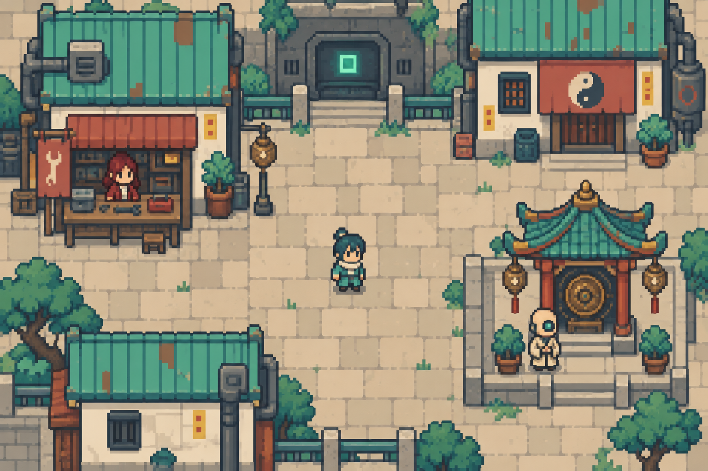

# DAOPUNK｜東方修仙 × 星球賽博龐克

> **機器人也能被算命嗎？**

故事從這個疑問開始。主角出身世界僅存的算命門派，是最後的人類後裔之一；同門學成後各自下山，肩負不同使命。主角在累世輪迴中保留自己的全部記憶，與失散的人重逢，也逐步追問命運、生命與世界的真相。

本作以有趣的人物、日常幽默、謎團與選擇後果承載道家思辨。只有人類能學算命，不代表只有人類值得被理解；知道命運，也未必有權替別人決定人生。

## 目前設計基準

**2026-09-26 世界觀重整版**：保留故事背景與本次 GBA 像素美術，先前玩法規格退役；本次確認保留五術，100種仙術消耗各別功德成本取得且跨世保留；戰鬥方式尚未定案。

| 項目 | 現況 |
|---|---|
| 故事 | 已統整世界骨架、人物、師門、輪迴、宇宙真相及四結局方向；補完提案與已確認設定分開 |
| 地理 | 十大宇宙、40 顆代表星球、100 個城市／聚落／街區地點；新增名稱多仍屬提案 |
| 美術 | 復古小比例像素＋現代精緻細節，16×16不設硬上限；東方修仙與星球科技並存 |
| 既有概念圖 | 十宇宙代表場景、16 張人物／道主／意象圖、40 個地點配置；非已完成遊戲素材 |
| 製作工具 | Blender 與 Godot；既有工程為 Godot 4.3／GDScript 歷史原型 |
| 遊戲程式 | 未依本次重整重寫；原型仍執行舊玩法，不能用它判定現行規則 |
| 未完成 | 新玩法、正式像素素材與動畫、鯤鵬新圖、新增60地點圖、完整劇情腳本及新系統實作 |

最新：[新版街區概念](docs/art-direction/modern-pixel/README.md) · [四季與天氣設計](docs/worldbuilding/SEASONS_AND_WEATHER.md)。

新增：[開發現況與待確認清單](docs/worldbuilding/DEVELOPMENT_STATUS.md) · [能力限制候選](docs/worldbuilding/ABILITY_BOUNDARIES.md) · [100地點氣候生活配置](docs/worldbuilding/CLIMATE_ATLAS.md)。

## 閱讀入口

以下是作者設定，部分文件含世界真相及導師身分劇透。

| 文件 | 用途 |
|---|---|
| [世界觀總入口](docs/worldbuilding/README.md) | 現行資料與版本優先順序 |
| [故事設定總綱](docs/worldbuilding/STORY_BIBLE.md) | 已確認事實、人物關係與待補設定 |
| [開場與最後人類師門](docs/worldbuilding/OPENING_AND_SECT.md) | 機器人算命疑問、同門使命及跨世相認提案 |
| [宇宙結構與四結局](docs/worldbuilding/ENDINGS_AND_COSMOLOGY.md) | 夢境泡泡、邊緣世界、鯤鵬與結局因果 |
| [道家思想與敘事原則](docs/worldbuilding/DAOIST_NARRATIVE.md) | 齊物、夢、無為等思想如何進入具體故事 |
| [人物與十大道主](docs/worldbuilding/CHARACTERS.md) | 身分、性格與人物分歧 |
| [星球與地點名錄](docs/worldbuilding/ATLAS.md) | 地理、地標、產業、政治與貿易 |
| [矛盾檢查](docs/worldbuilding/CONTINUITY_AUDIT.md) | 39項衝突、缺口與寫作邊界及其處理狀態 |
| [現行美術基準](docs/worldbuilding/ART_BIBLE.md) | 最新風格、角色辨識及素材製作限制 |
| [更新紀錄](CHANGELOG.md) | 本次變更、退役範圍、驗證與未決事項 |

## 世界真相（作者版劇透）

十大宇宙是造物主夢中的泡泡，一個泡泡是一個宇宙級世界。宇宙間隙存在邊緣世界，其最底層連著夢境底層；鯤鵬是三大創世生命之一，形態為有翅膀的巨大鯨魚。道主們知道世界的本質，知情者對喚醒、維持沉睡或取代造物主有不同立場。

抹殺只是將人送入輪迴；大部分人會失去前世記憶，主角則記得自己經歷的一切。完整記憶不等於全知。同門相認依相遇狀態而定：留世者可相認，轉生者通常失憶但修行能解鎖記憶，導師始終認得。相認不等於必定幫忙。

四個敘事方向為守護夢境、喚醒真實、弒神奪位與煉假成真。具體因果及代價逐步補完，不把任何一路預先視為標準答案。

## 舊資料與工程

[退役範圍](docs/worldbuilding/RESET_SCOPE.md)包含舊即時／卡牌戰鬥、225卡數量、兩術兼修、技能樹、肉鴿流程、購屋、城市隨機生成及NPC排程等規格。歷史檔案留作追溯；不得自動恢復為現行設計。

如需查看舊工程，可用 Godot 4.3 開啟根目錄的 `project.godot`；操作資料見[歷史原型說明](docs/archive/LEGACY_PROTOTYPE_README.md)。這不是新世界觀版本的可玩驗收。

## 後續更新方式

每次故事定案，同步更新對應文件、[設定權威索引](docs/worldbuilding/authority.json)及 [CHANGELOG](CHANGELOG.md)。紀錄日期、確認／提案狀態、取代哪些舊說法、驗證結果及仍待回答的問題，避免不同版本同時生效。

世界持續前進、主角每世仍為人類已確認；下一批優先釐清轉生耗時與改造後的算命資格、造物主醒／死後眾生的延續、主角記憶例外原因與觀察者權限，再逐步完成開場及同門重逢。

最新能力基準：[100種跨世仙術](docs/worldbuilding/IMMORTAL_ARTS_FRAMEWORK.md)。一般99年為基礎；醫術與換身延壽只限本世，延壽仙術跨世保留。

歸墟最新背景：與我們所在宇宙及地球相連，如今不穩且破碎，原因未知；地球與蔓哈頓深坑星的關係仍待確認。

本批：[十大道主能力詳案](docs/worldbuilding/DAO_RULER_POWERS.md) · [交給Claude的故事提示詞](docs/worldbuilding/CLAUDE_STORY_PROMPT.md)。

中立組織（含殺手組織）可透過新聞與口述持續出現，不要求每世直接接觸：[近況敘事規格](docs/worldbuilding/NEUTRAL_ORGANIZATION_NEWS.md)。

實作準備：[輪迴保存契約](docs/contracts/REINCARNATION_DATA.md)。離線檢查命令：`python3 tools/check_reincarnation_contract.py`，目前17項通過；不是新版Godot遊戲驗收。

已收[Claude第一批A～D故事草稿](docs/story-drafts/claude-batch-01/README.md)，保留原文並附一致性檢查；尚未將新增真相全部定案或接入Godot。

已續收[R01紅篇《一盞燈的高度》](docs/story-drafts/red-r01/README.md)，與第一批S01及未來S02分開管理。

故事續稿：[Z01零號篇《半邊夢》](docs/story-drafts/zero-z01/README.md)已收錄；全部交稿、已答決策與修訂入口見[故事交稿索引](docs/story-drafts/README.md)。

本次續收[X01星塵篇](docs/story-drafts/stardust-x01/README.md)、[D01首次死亡](docs/story-drafts/death-d01/README.md)、[S02紅重逢v2](docs/story-drafts/red-reunion-s02-v2/README.md)、[M01大師兄篇](docs/story-drafts/elder-m01/README.md)及[F01四師姐篇](docs/story-drafts/fourth-sister-f01/README.md)：共36場原稿與66項文本檢查，附逐篇Claude修訂提示；尚未定稿或接入Godot。

續收[Y01閻羅X篇《未交接》](docs/story-drafts/yanluo-y01/README.md)：七場原稿、14項檢查及修訂提示。交接印、封存權限及棋局仍是提案；未授予新法則或接入Godot。

統整交接：[給Claude的九篇全稿整理指令](docs/story-drafts/CLAUDE_CONSOLIDATION_PROMPT.md) · [跨篇故事資料契約](docs/contracts/STORY_EVENT_DATA.md) · [製作工作清單](docs/production/STORY_PRODUCTION_PLAN.md)。本批完成文件與依賴盤點，尚未接入引擎。

故事更新：[共同年表及五篇新版](docs/story-drafts/revisions-batch-01/README.md)已收錄，另附16項二次檢查與續修提示。這批以原稿修訂補丁交付，未經作者定案的人口／回歸方案仍保持待定。
