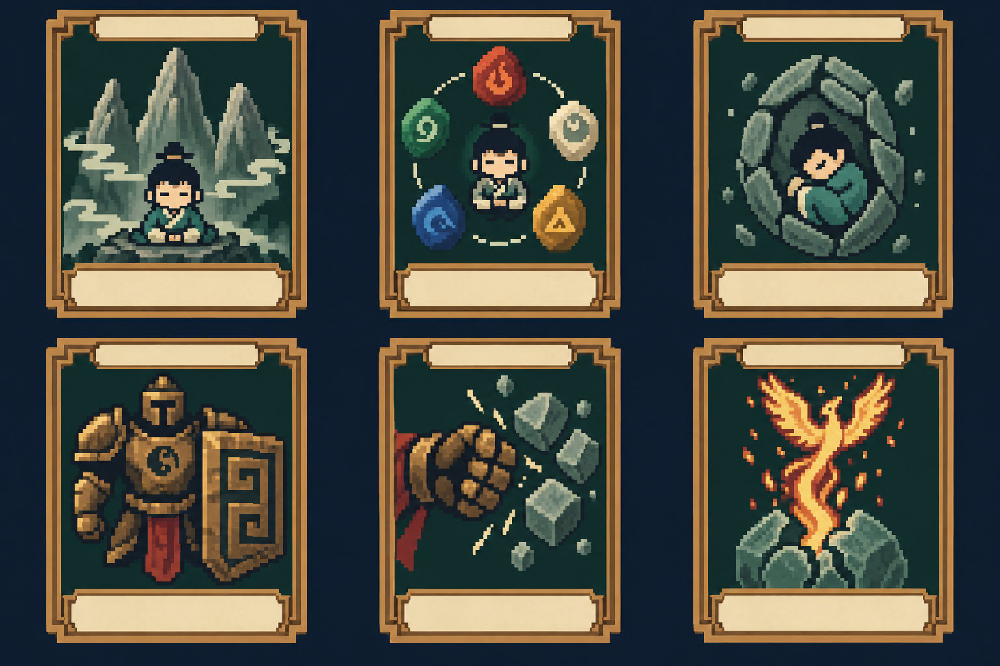
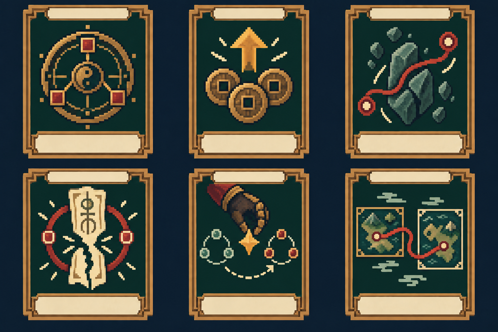
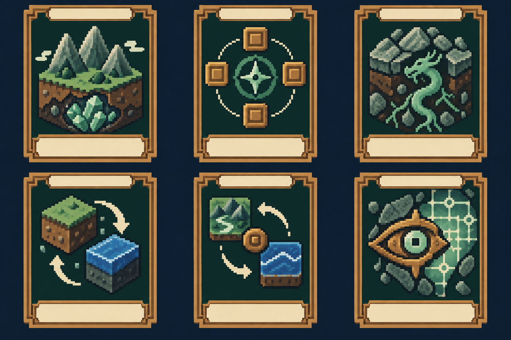

# 五術＝五個主修職業：修行樹與卡牌提案

> 舊版草案存檔：正式五術及新路徑以[五術 v2：15 分支、45 卡](../five-arts-v2/README.md)為準。下文 30 招不是額外新增卡池；與新規則衝突的復活、壽命與世界線描述不再採用。

依使用者「像殺戮尖塔不同職業」的方向規劃。以下是新設計，**現有遊戲仍是即時探索與 Tactical Pause，尚未實作職業牌組戰鬥**。

類型已確認為肉鴿；依[核心循環](../../design/ROGUELITE_LOOP.md)，實際牌組、卡牌升級與本輪戰鬥配置在勝敗結算後重置，跨世保留候選卡池與分支解鎖。以下卡牌規則仍待原型驗證。

## 三層成長

1. **跨輪迴修行樹**：解鎖分支與候選卡池，主要增加策略選項，不無限加攻防。
2. **本趟牌組構築**：選一個主修，獎勵以本派為主。解鎖卡牌不等於自動塞入牌組，可選擇略過獎勵。
3. **跨職業法則**：十大宇宙法則另置法則槽；原型先限制一個主法則，避免十種高階權能疊加。完整世界觀的法則繼承不因此被刪除。

兼修提案：每趟至多選一個副修，副修卡占牌組上限約四分之一，先限制在初、中階；是否採用比例限制須試玩後定案。以主修被動與獎勵權重維持職業辨識。

## 可測試的最小卡牌循環（新提案，非既有規則）

起手 10 張＝4 張共通攻擊＋4 張共通防禦＋2 張主修基礎牌。每回合 3 氣、抽 5 張，回合結束未保留牌進棄牌堆；抽牌堆空時洗回棄牌。共通攻防目前只列原型需求，不計入本次 40 種已畫卡牌。

每場勝利提供三選一或略過，休息點提供恢復／升級二選一。第一個垂直切片只驗證山術與卜術、1 個宇宙、6～8 個節點；五派共 30 招是美術與設計起點，**不是每派已足夠上線的完整卡池**。

原有技能檔包含長時間冷卻、壽命、讀檔、功德門檻等 RPG 規則。這些不直接換算成回合數；原資料保留，新卡意圖另存，成本與平衡值待原型測試。

## 五派修行樹

箭頭是本次提出的前置解鎖關係，不是現有程式已執行的技能樹。終階卡須同時通過前置路線与對應劇情／試煉；本次不指定未驗證數值門檻。


### 山術｜山術行者

定位：護體、蓄勢、反擊。

主修被動提案：每回合第一次獲得護體時得到一層蓄勢；蓄勢上限待測。

來源既有分支：修命／修性。

```text
修命：基礎吐納 → 五行吐納 → 金剛不壞 → 真空粉碎
修性：基礎吐納 → 胎息法 → 涅槃重生
```

補充：護體不等於永久回血；蓄勢消耗與傷害設上限。



| 格位 | 卡片／既有 ID | 卡牌轉譯意圖（待平衡） |
|---|---|---|
| 1 | 基礎吐納／`basic_breathing` | 獲得少量護體並累積一層蓄勢；作為主修起手核心。 |
| 2 | 五行吐納／`five_elements_breathing` | 選擇一種五行姿態，改變下一張山術牌的附加效果。 |
| 3 | 胎息法／`hibernation` | 消耗本回合進攻機會，換取下回合護體；不可無限拖戰恢復。 |
| 4 | 金剛不壞／`diamond_body` | 在本回合吸收一次高額傷害；高費、使用後本戰移除。 |
| 5 | 真空粉碎／`vacuum_crush` | 消耗累積蓄勢造成傷害；有上限，不沿用功德乘十公式。 |
| 6 | 涅槃重生／`nirvana_rebirth` | 本戰首次致命傷改為低血量存活；每戰一次且移除，不重置資源。 |


### 醫術｜醫術行者

定位：治療、淨化、轉移傷勢。

主修被動提案：首次清除負面狀態時獲得一份藥引；每回合一次。

來源既有分支：治療／驅鬼。

```text
治療：基礎針灸 → 五臟調理 → 續命金針 → 起死回生
生命進階：五臟調理 → 奪天改命 → 長生術
```

補充：原有驅鬼分支尚無專屬六招映射，保留分支位置，不假裝已完成驅鬼卡池。


| 格位 | 卡片／既有 ID | 卡牌轉譯意圖（待平衡） |
|---|---|---|
| 1 | 基礎針灸／`basic_acupuncture` | 恢復少量生命或止血二選一；每戰治療總額受限。 |
| 2 | 五臟調理／`organ_healing` | 清除一項負面狀態，並依清除類型獲得護體或抽牌。 |
| 3 | 續命金針／`life_extending_needle` | 保住一個瀕死友方／劇情目標；事件使用與戰鬥使用分開。 |
| 4 | 起死回生／`resurrection` | 讓已倒下的同行者本戰復起一次；不能藉此重置其技能次數。 |
| 5 | 奪天改命／`life_transfer` | 把自己的部分生命轉成指定目標的恢復或傷害；不能吸取無限生命。 |
| 6 | 長生術／`longevity` | 本戰有限回合逐步恢復；每戰治療上限依然適用。 |


### 命術｜命術行者

定位：命運標記、結果改寫、警戒代價。

主修被動提案：首次觀命可保留一個命運標記至下回合；標記上限待測。

來源既有分支：知命／改命／遮天。

```text
知命：觀命 → 測運
改命：測運 → 改命 → 逆天改命 → 奪舍天命
終階：逆天改命 → 改寫世界線
```

補充：遮天分支需另設配套卡；五術遮天技巧不等同 U-008 遮天法則。



| 格位 | 卡片／既有 ID | 卡牌轉譯意圖（待平衡） |
|---|---|---|
| 1 | 觀命／`observe_fate` | 標記一個敵人的命運節點，強化下一次針對該目標的干涉。 |
| 2 | 測運／`fortune_reading` | 揭示下一個事件的結果類別或下一回合的敵意，不能直接保證收益。 |
| 3 | 改命／`destiny_change` | 消耗標記調整一個可改写的結果，提高世界變動率。 |
| 4 | 逆天改命／`heaven_defying` | 撤銷一個已預告的高威脅結果；高費、移除、增加更多變動率。 |
| 5 | 奪舍天命／`steal_destiny` | 轉移指定命運標記或增益；不直接控制 NPC 感情與人格。 |
| 6 | 改寫世界線／`rewrite_worldline` | 重選本回合一個允許的結果；保留已付代價與移除紀錄，不能無限回溯。 |


### 相術｜相術行者

定位：場地槽、五行配置、連鎖。

主修被動提案：第一個陣位可在下回合保留；全場固定三槽，禁止無限堆疊。

來源既有分支：風水／面相。

```text
風水：尋龍點穴 → 風水佈局 → 龍脈感知 → 改天換地 → 逆轉乾坤
洞察：龍脈感知 → 破妄之眼
```

補充：既有面相分支尚缺專屬招式；洞察路線為本次卡牌轉譯提案。



| 格位 | 卡片／既有 ID | 卡牌轉譯意圖（待平衡） |
|---|---|---|
| 1 | 尋龍點穴／`dragon_seeking` | 揭示場地五行，下一張匹配場地的卡獲得附加效果。 |
| 2 | 風水佈局／`feng_shui_setup` | 在三個場地槽之一放入陣位；槽位數是新原型規則。 |
| 3 | 龍脈感知／`dragon_vein_sense` | 連接兩個已放置的陣位，提供一次連鎖收益。 |
| 4 | 改天換地／`heaven_earth_reversal` | 交換兩個場地槽的位置與作用方向；不能複製槽內物件。 |
| 5 | 逆轉乾坤／`cosmos_inversion` | 重排全部場地槽並觸發一次完整陣法；高費且移除。 |
| 6 | 破妄之眼／`truth_seeing_eye` | 揭示並解除敵方一項偽裝或隱藏場地效果。 |


### 卜術｜卜術行者

定位：敵意預見、抽牌排序、預先應對。

主修被動提案：首回合額外查看一張牌頂，只看不抽。

來源既有分支：卜卦／趨吉避凶／改變走向。

```text
卜卦：銅錢卜卦 → 梅花易數 → 六爻神斷
趨吉避凶：梅花易數 → 奇門遁甲 → 推背圖
改變走向：六爻神斷 → 時間回溯
```

補充：未來預見需有明確範圍；時間回溯只處理允許的牌與排序，不是整局免費讀檔。


| 格位 | 卡片／既有 ID | 卡牌轉譯意圖（待平衡） |
|---|---|---|
| 1 | 銅錢卜卦／`coin_divination` | 查看抽牌堆頂若干張並調整順序；不創造額外牌。 |
| 2 | 梅花易數／`plum_blossom` | 依已看見的牌型獲得護體或抽牌，獎勵事前判斷。 |
| 3 | 奇門遁甲／`qimen_dunjia` | 從公開的三個預備效果中選一個，在指定時機觸發。 |
| 4 | 六爻神斷／`six_lines_divination` | 揭示敵人更遠一回合的意圖，並設置一次對應防備。 |
| 5 | 推背圖／`tuibei_prophecy` | 標記一個已公開事件類別，命中時獲得有限資源。 |
| 6 | 時間回溯／`time_rewind` | 取回上一張普通牌或重排牌頂；不回復能量、不取回自身、不重置移除牌。 |

## 十大法則卡與職業的關係

法則圖示沿用宇宙主表。每個職業皆可接觸法則，不以「醫術只能拿生命」等方式重分配世界觀。五術負責常規打法，法則改變局部規則並帶來世界代價。命術「時間回溯／改寫世界線」類表述須區分技能與法則權限，不能因卡名相近就取得全宇宙權能。

## 待實作與驗證

- 主修選擇、卡牌 Resource、抽棄牌、回合解算、敵意預告、獎勵、修行樹、存檔都尚未接入。
- 測試醫術無限回血、回溯無限能量、相術無限陣位、命術刷低風險獎勵等組合漏洞。
- 共通卡、敵人卡、狀態牌、詛咒與各派額外分支卡未全部設計；後續隨玩法驗證補充，不能聲稱本批已涵蓋未来所有卡片。
- 所有卡牌目前是圖版，不是獨立透明素材；正式卡片需分層整理及 UI 可讀性驗證。
