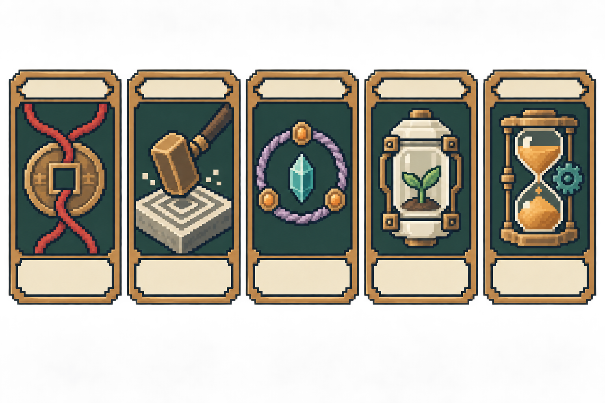
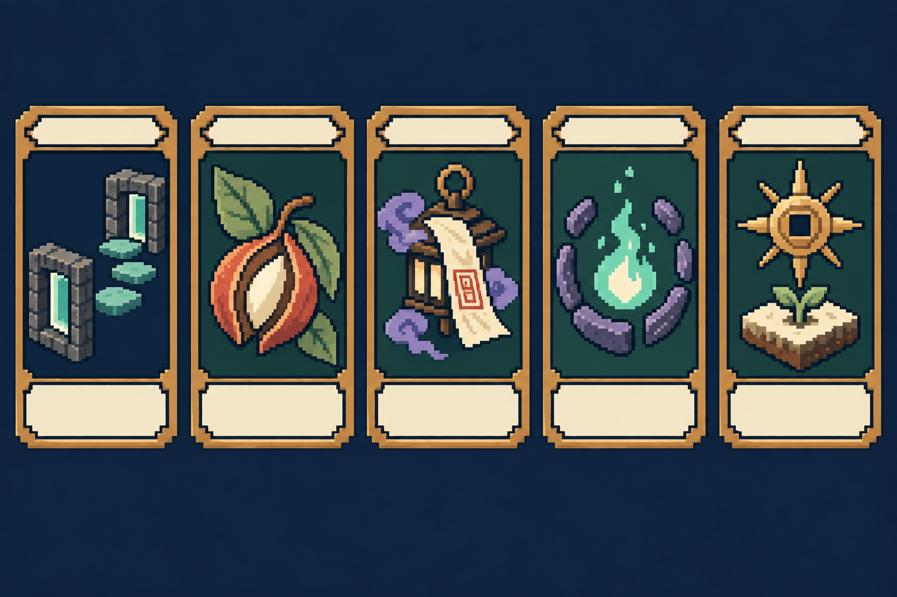
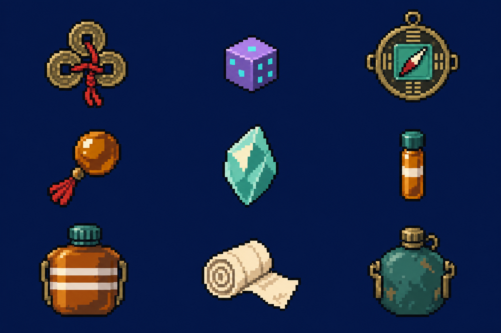
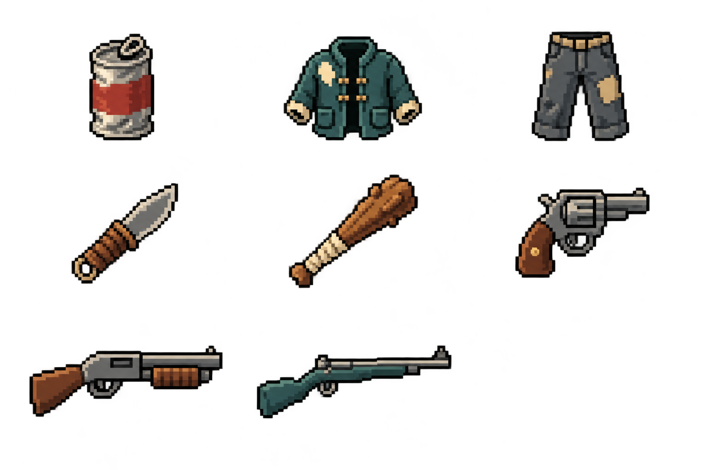

# 卡牌與道具美術

[十大宇宙圖鑑](../universes/README.md) · [五术職業、修行樹與卡牌轉譯](FIVE_ARTS.md)

本次完成 **30 種五術技能卡概念、10 種法則卡概念、17 種既有道具概念**。另保留一張五術初版方向圖，當中的五張不是新增卡牌，不重複計入 40 種。

全部為內建 imagegen 繪製的原創美術設定稿，完整提示詞見 [PROMPTS.md](PROMPTS.md)。卡名與圖格對照如下；大圖保留空白標題／效果區，方便 Godot 用可編輯文字疊加。

## 五術卡（每張圖：上排左至右，再下排左至右）

### 山術完整六招

1. 基礎吐納（`basic_breathing`）
2. 五行吐納（`five_elements_breathing`）
3. 胎息法（`hibernation`）
4. 金剛不壞（`diamond_body`）
5. 真空粉碎（`vacuum_crush`）
6. 涅槃重生（`nirvana_rebirth`）

### 醫術完整六招

1. 基礎針灸（`basic_acupuncture`）
2. 五臟調理（`organ_healing`）
3. 續命金針（`life_extending_needle`）
4. 起死回生（`resurrection`）
5. 奪天改命（`life_transfer`）
6. 長生術（`longevity`）

### 命術完整六招

1. 觀命（`observe_fate`）
2. 測運（`fortune_reading`）
3. 改命（`destiny_change`）
4. 逆天改命（`heaven_defying`）
5. 奪舍天命（`steal_destiny`）
6. 改寫世界線（`rewrite_worldline`）

### 相術完整六招

1. 尋龍點穴（`dragon_seeking`）
2. 風水佈局（`feng_shui_setup`）
3. 龍脈感知（`dragon_vein_sense`）
4. 改天換地（`heaven_earth_reversal`）
5. 逆轉乾坤（`cosmos_inversion`）
6. 破妄之眼（`truth_seeing_eye`）

### 卜術完整六招

1. 銅錢卜卦（`coin_divination`）
2. 梅花易數（`plum_blossom`）
3. 奇門遁甲（`qimen_dunjia`）
4. 六爻神斷（`six_lines_divination`）
5. 推背圖（`tuibei_prophecy`）
6. 時間回溯（`time_rewind`）

## 十大法則卡（每張圖從左至右）

### 法則卡 U-001–U-005

1. U-001 命運（`law_fate`）
2. U-002 因果（`law_causality`）
3. U-003 輪迴（`law_reincarnation`）
4. U-004 生命（`law_life`）
5. U-005 時間（`law_time`）

### 法則卡 U-006–U-010

1. U-006 空間（`law_space`）
2. U-007 真實（`law_truth`）
3. U-008 遮天（`law_concealment`）
4. U-009 靈魂（`law_soul`）
5. U-010 創世（`law_creation`）

法則卡是跨職業高階權能的呈現提案，不等同於一般五術技能。數值、取得條件與牌組限制需經原型驗證。

## 道具（每張圖逐排左至右）

| 既有 ID | 中文顯示對照 | 圖版 | 格位 |
|---|---|---|---|
| `tongqian` | 銅錢 | 工具與消耗品 | 1 |
| `quantum_dice` | 量子骰子 | 工具與消耗品 | 2 |
| `cyber_compass` | 賽博羅盤 | 工具與消耗品 | 3 |
| `merit_bead` | 功德珠 | 工具與消耗品 | 4 |
| `soul_crystal` | 靈魂水晶 | 工具與消耗品 | 5 |
| `stamina_potion_small` | 體力藥水（小） | 工具與消耗品 | 6 |
| `stamina_potion_large` | 體力藥水（大） | 工具與消耗品 | 7 |
| `bandage` | 繃帶 | 工具與消耗品 | 8 |
| `water` | 飲用水 | 工具與消耗品 | 9 |
| `canned_food` | 罐頭食物 | 裝備與武器 | 1 |
| `worn_coat` | 破舊外套 | 裝備與武器 | 2 |
| `work_pants` | 工作褲 | 裝備與武器 | 3 |
| `knife` | 小刀 | 裝備與武器 | 4 |
| `wooden_club` | 木棒 | 裝備與武器 | 5 |
| `revolver` | 左輪手槍 | 裝備與武器 | 6 |
| `shotgun` | 霰彈槍 | 裝備與武器 | 7 |
| `rifle` | 步槍 | 裝備與武器 | 8 |

裝備與武器圖的第九格留白。英文物品名稱的中文是本圖鑑顯示對照，沒有修改既有 .tres。

## 共用規格與製作限制

- 道具製作目標 24×24 或 32×32 px；長武器可用 48×24，背包顯示再置於同一格中心。大藥水與小藥水以輪廓＋兩條／一條標記區分。
- 卡圖目標 48×64 px，卡框／文字分層。卡面在高解析度 UI 層放大展示，中文可讀性優先，不要求把整張卡硬塞入低解析度地圖。
- 卡框採古銅、米色文字區、深色底。流派形狀標籤另行加在 UI：山峰／針葉／命盤／陣位／銅錢；法則卡使用宇宙編號徽記。
- 圖版中的所有圖案已逐項目視核對，並修正六爻神斷由五條為六條。生成圖局部仍有柔光、多色階及不完全一致的卡框，是下一輪像素清理項目。
- **這些是含背景的美術圖版，不是已切片、透明且 pixel-perfect 的獨立 PNG。** 未宣稱可直接作為 SpriteFrames 或 AtlasTexture 使用。正式輸出須分件、對齊、清理透明邊、校驗像素尺寸。
- 本次未新增玩法程式，未把概念圖掛入 .tres；也未將五術的 30 招直接假定為已平衡的完整職業卡池。
