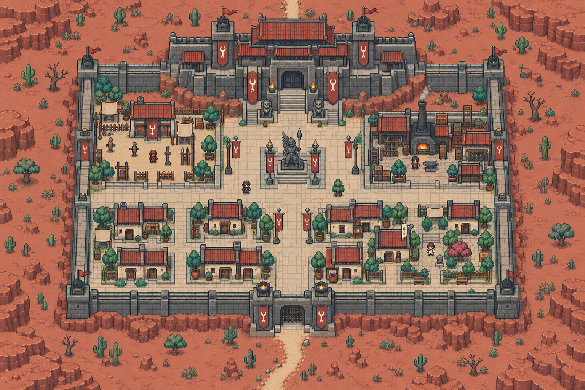
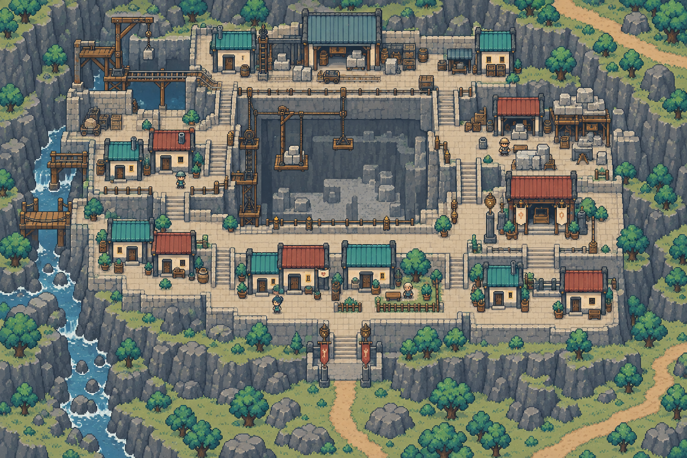
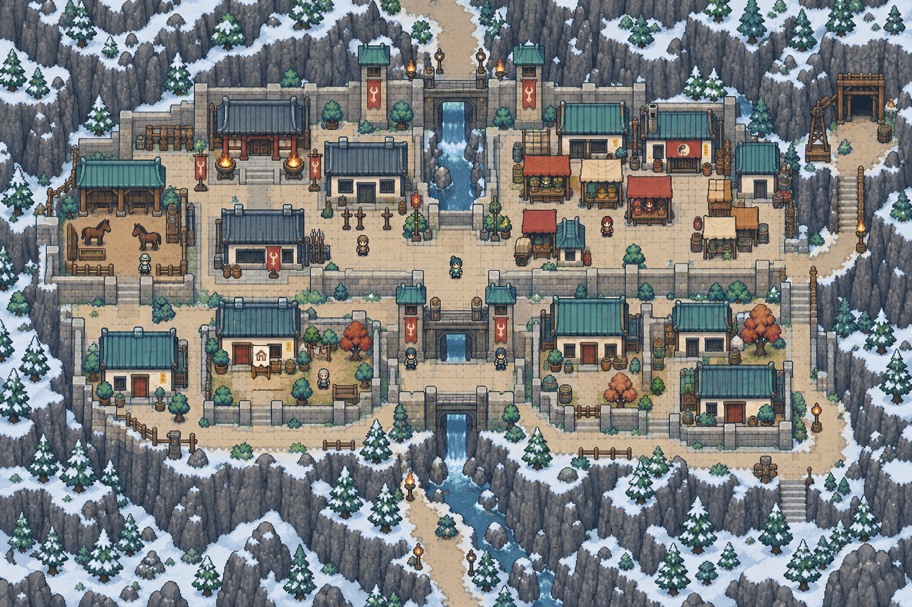
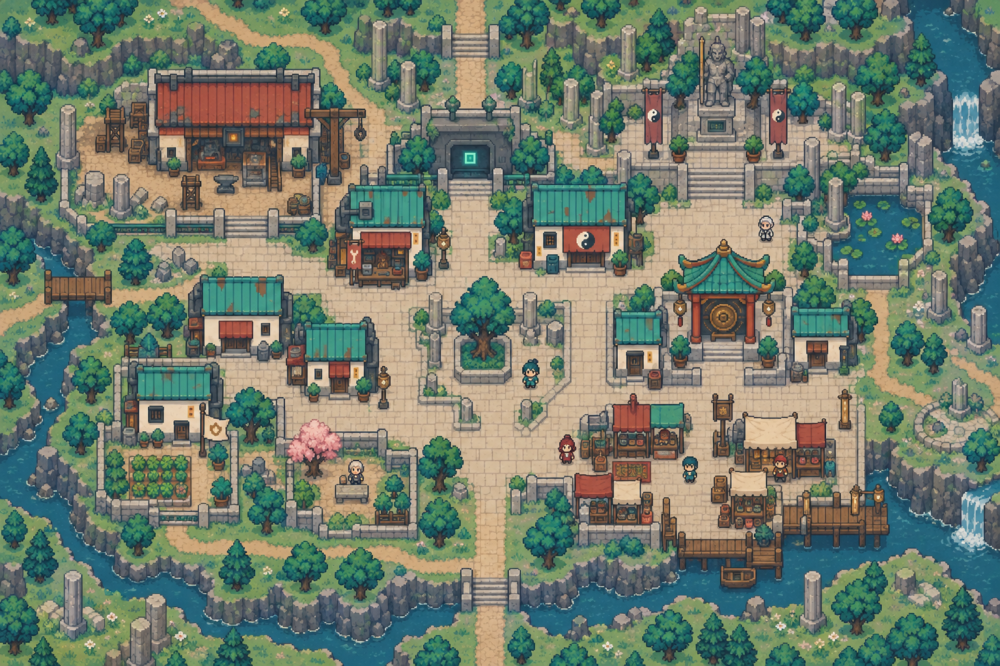

# 武神界・完整地點配置

[返回索引](README.md)

## U-002-P1-C1｜演武城區

所屬：赤岳星。狀態：描述性模板；正式地名待定。

布局意圖：red sandstone martial city, broad T-shaped ceremonial road, northern massive fortress, western training squares, eastern smithy quarter, southern compact houses, two gates and thick stepped walls。

住宅：一棟候選可購住宅，米色小旗、獨立門前通路；非所有建築可買。

## U-002-P1-C2｜採石城區

所屬：赤岳星。狀態：描述性模板；正式地名待定。

布局意圖：quarry city built on three LOW visible terraces, central square quarry pit edged with barriers, pulley platforms to west, stonecutters east, terraced homes south, north block depot; ramps clearly connect terraces。

住宅：一棟候選可購住宅，米色小旗、獨立門前通路；非所有建築可買。

## U-002-P2-C1｜山關城區

所屬：鐵關星。狀態：描述性模板；正式地名待定。

布局意圖：cold mountain pass fortified town, north-south canyon road, two staggered gates, steel-gray tiled barracks, west stable court, east market, southern homes inside windbreak walls。

住宅：一棟候選可購住宅，米色小旗、獨立門前通路；非所有建築可買。

## U-002-P2-C2｜戰後聚落

所屬：鐵關星。狀態：描述性模板；正式地名待定。

布局意圖：postwar rebuilt settlement, irregular streets following broken old columns, northeast memorial court, west communal repair hall, southwest patched houses and garden, southeast small market。

住宅：一棟候選可購住宅，米色小旗、獨立門前通路；非所有建築可買。

