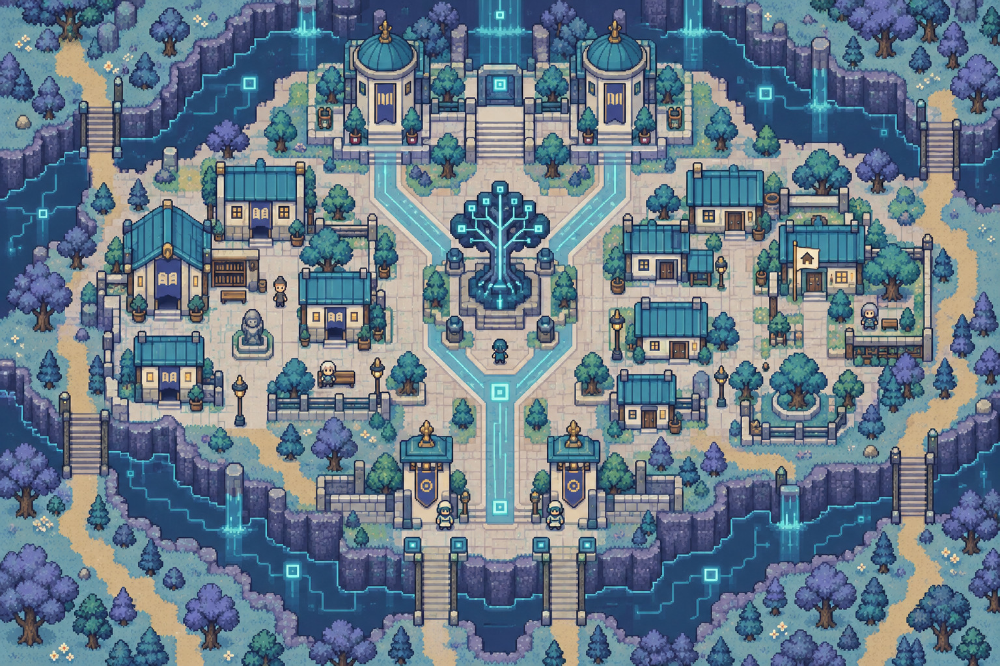
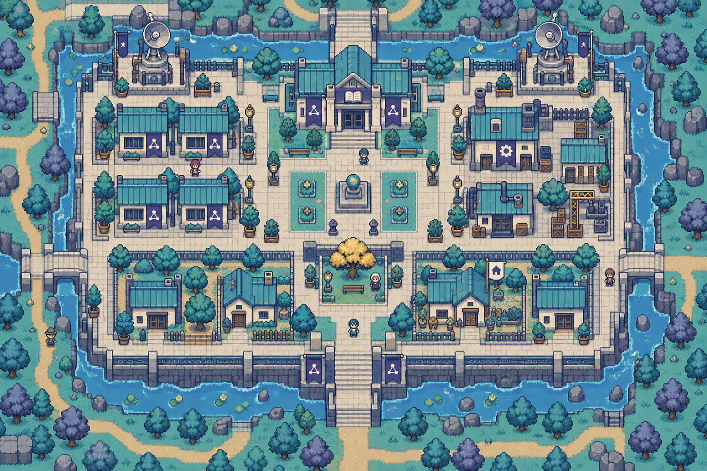
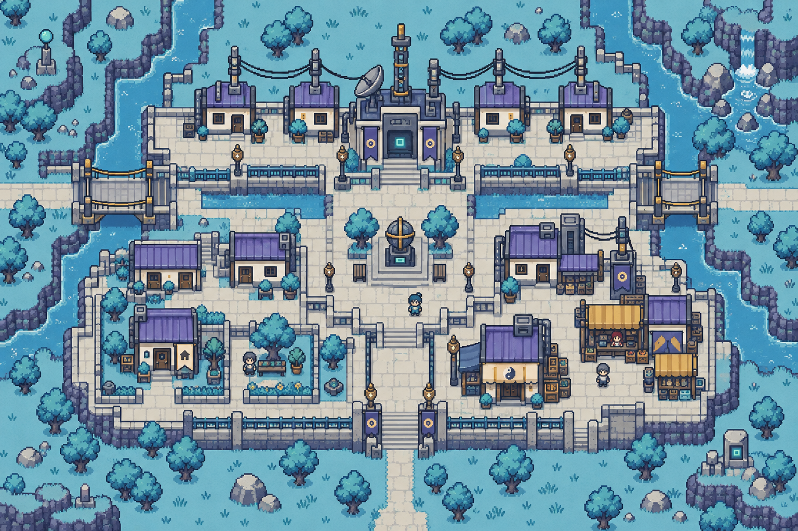
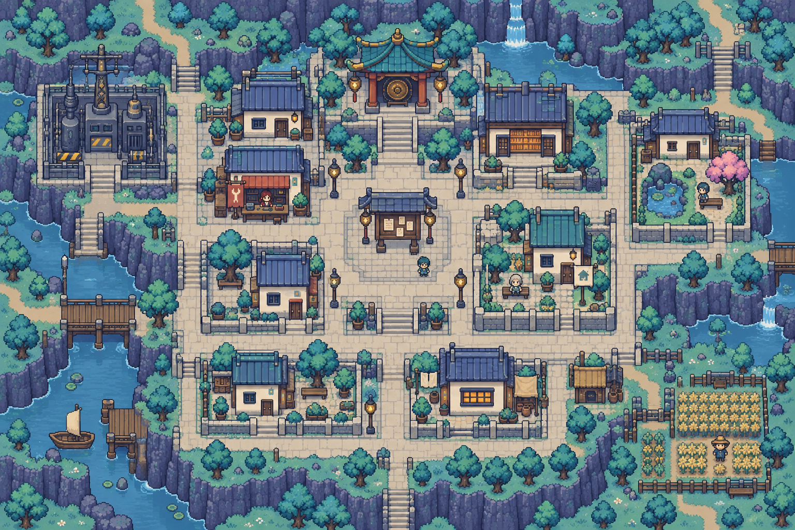

> **現行美術以[本次美術基準](../../worldbuilding/ART_BIBLE.md)為準。** 圖像保留為概念參考；本文涉及卡牌、獎勵、生成與遊戲流程的舊規格全部退役。人物與地理依世界觀統整。

# 神經網・完整地點配置

[返回索引](README.md)

## U-003-P1-C1｜記憶城區

所屬：織憶星。狀態：描述性模板；正式地名待定。

布局意圖：memory node city, branching Y-shaped cyan circuit roads, central memory-tree antenna, paired ceramic archives north, reading halls west, citizen homes east, two southern access gates。

住宅：一棟候選可購住宅，米色小旗、獨立門前通路；非所有建築可買。

## U-003-P1-C2｜學院城區

所屬：織憶星。狀態：描述性模板；正式地名待定。

布局意圖：network academy city, rectangular campus quad, paired antennas at northwest and northeast, west classroom rows, east workshops, south student houses, central low library and quiet square。

住宅：一棟候選可購住宅，米色小旗、獨立門前通路；非所有建築可買。

## U-003-P2-C1｜中繼城區

所屬：續訊星。狀態：描述性模板；正式地名待定。

布局意圖：signal relay city on pale blue plain, diagonal-free ladder road plan, two cable bridge crossings over narrow channels, long low relay houses north, homes southwest, service market southeast。

住宅：一棟候選可購住宅，米色小旗、獨立門前通路；非所有建築可買。

## U-003-P2-C2｜離線聚落

所屬：續訊星。狀態：描述性模板；正式地名待定。

布局意圖：offline settlement, offset courtyards among dark disconnected cabinets, warm amber paper reading halls, cream homes, central handwritten notice kiosk without text, west dormant substation and east garden。

住宅：一棟候選可購住宅，米色小旗、獨立門前通路；非所有建築可買。

