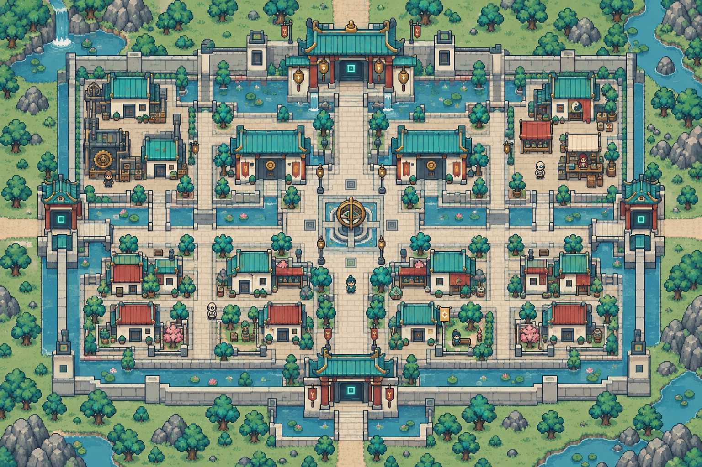
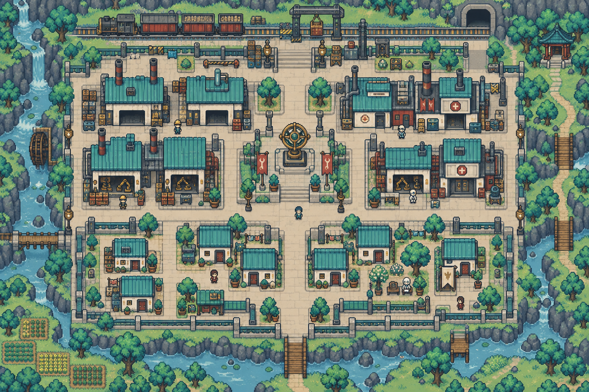
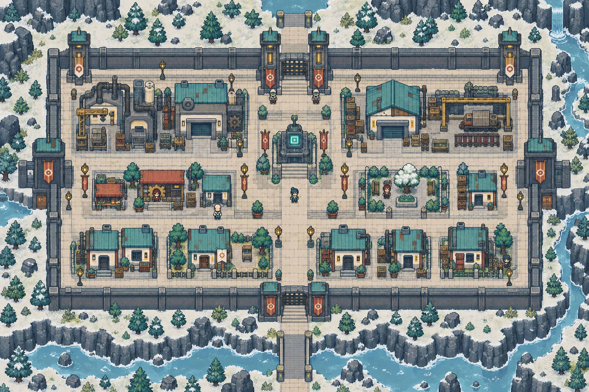
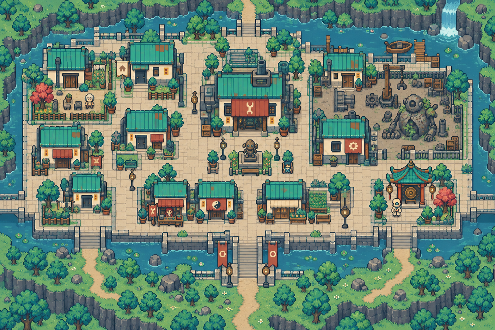

# 智械天庭・完整地點配置

[返回索引](README.md)

## U-004-P1-C1｜登錄城區

所屬：玉衡星。狀態：描述性模板；正式地名待定。

布局意圖：machine heavenly registration city, perfectly symmetrical axial plan, north palace gate, central registration square, paired office blocks and straight channels, southern citizen homes, four cardinal gates。

住宅：一棟候選可購住宅，米色小旗、獨立門前通路；非所有建築可買。

## U-004-P1-C2｜製造城區

所屬：玉衡星。狀態：描述性模板；正式地名待定。

布局意圖：manufacturing city, neat modular factory blocks in checkerboard, central inspection court, west assembly sheds, east body repair clinics, south residential modules, north rail loading exit。

住宅：一棟候選可購住宅，米色小旗、獨立門前通路；非所有建築可買。

## U-004-P2-C1｜邊防城區

所屬：寒序星。狀態：描述性模板；正式地名待定。

布局意圖：cold metal border city, long rectangular rampart, north three short watchtowers, parallel patrol streets, central checkpoints, east depot, west maintenance, south insulated homes。

住宅：一棟候選可購住宅，米色小旗、獨立門前通路；非所有建築可買。

## U-004-P2-C2｜退役聚落

所屬：寒序星。狀態：描述性模板；正式地名待定。

布局意圖：retired-machine settlement, original rigid modular street grid softened by mismatched awnings and planters, central communal workshop, old chassis park east, personal decorated homes west, southern entrance。

住宅：一棟候選可購住宅，米色小旗、獨立門前通路；非所有建築可買。

