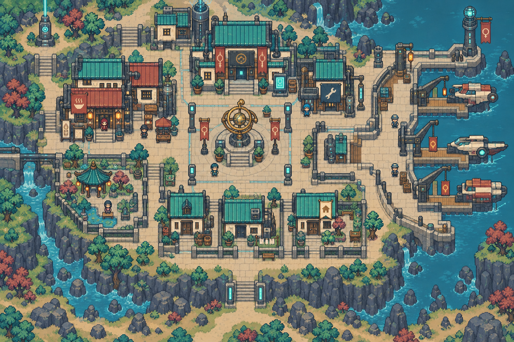
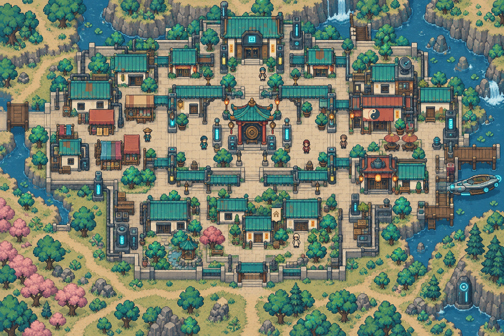
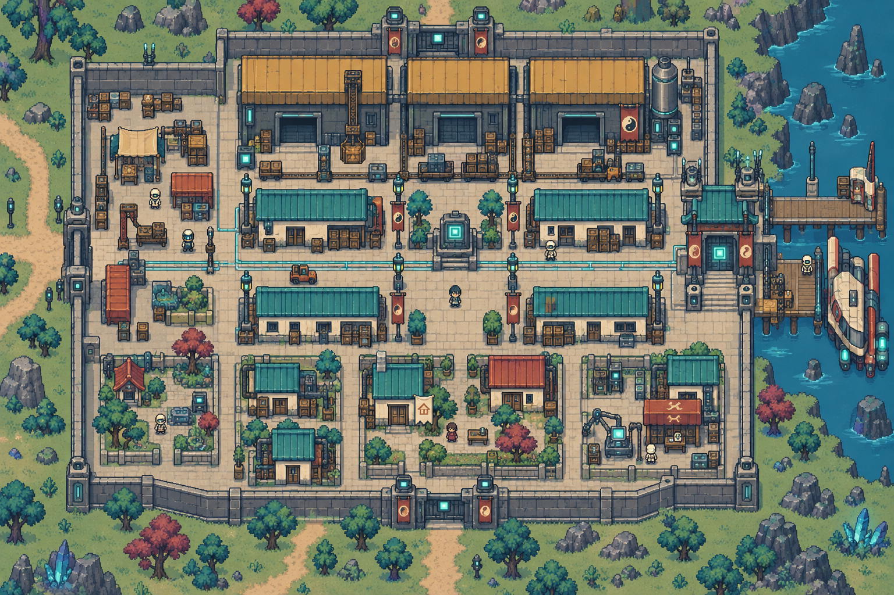
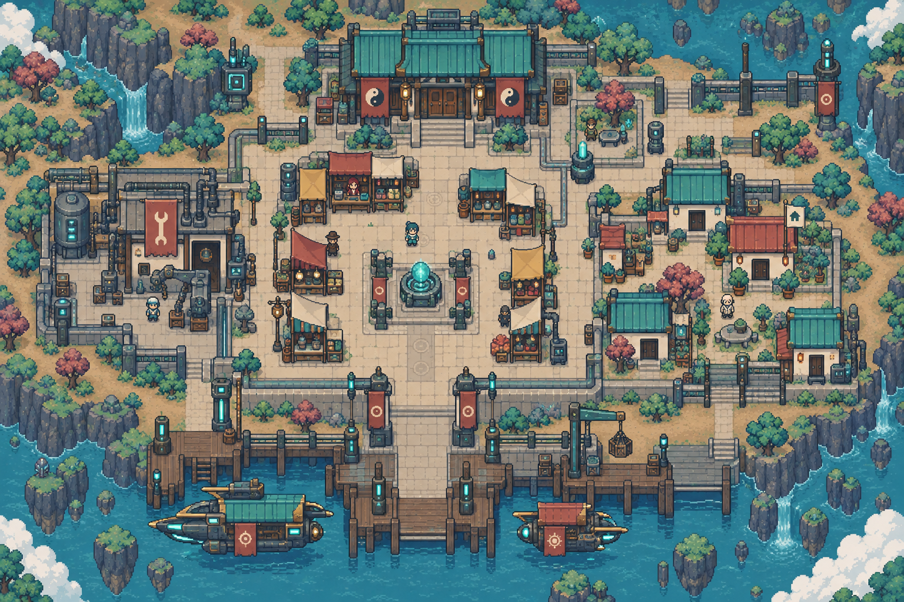

> **現行美術以[本次美術基準](../../worldbuilding/ART_BIBLE.md)為準。** 圖像保留為概念參考；本文涉及卡牌、獎勵、生成與遊戲流程的舊規格全部退役。人物與地理依世界觀統整。

# 星際商盟・完整地點配置

[返回索引](README.md)

## U-005-P1-C1｜商港城區

所屬：衡金星。狀態：描述性模板；正式地名待定。

布局意圖：warm interstellar trade port, crescent-like stepped square dock edge on east, small shuttles at three bays, central brass clock market, west inns, north exchange, south homes; orthogonal streets。

住宅：一棟候選可購住宅，米色小旗、獨立門前通路；非所有建築可買。

## U-005-P1-C2｜舊市城區

所屬：衡金星。狀態：描述性模板；正式地名待定。

布局意圖：old merchant city, narrow right-angle covered lanes, central pawnshop court, cloth market west, inns and tea houses east, north small exchange hall, south residential courtyard and service alley。

住宅：一棟候選可購住宅，米色小旗、獨立門前通路；非所有建築可買。

## U-005-P2-C1｜保稅城區

所屬：通衢星。狀態：描述性模板；正式地名待定。

布局意圖：bonded warehouse town, long parallel cargo streets, large closed warehouse blocks north, customs gate east, workers homes south, packing courtyard west, visible boundary fence with two road gates。

住宅：一棟候選可購住宅，米色小旗、獨立門前通路；非所有建築可買。

## U-005-P2-C2｜邊境集市

所屬：通衢星。狀態：描述性模板；正式地名待定。

布局意圖：frontier caravan market, offset rows of patchwork stalls, central dusty caravan square, west repair stop, east mixed small housing, north bargain hall, south docking road; contrasting goods color blocks。

住宅：一棟候選可購住宅，米色小旗、獨立門前通路；非所有建築可買。

