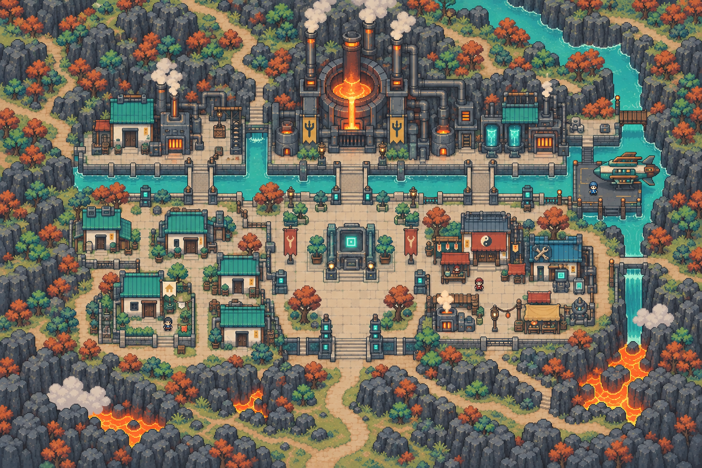
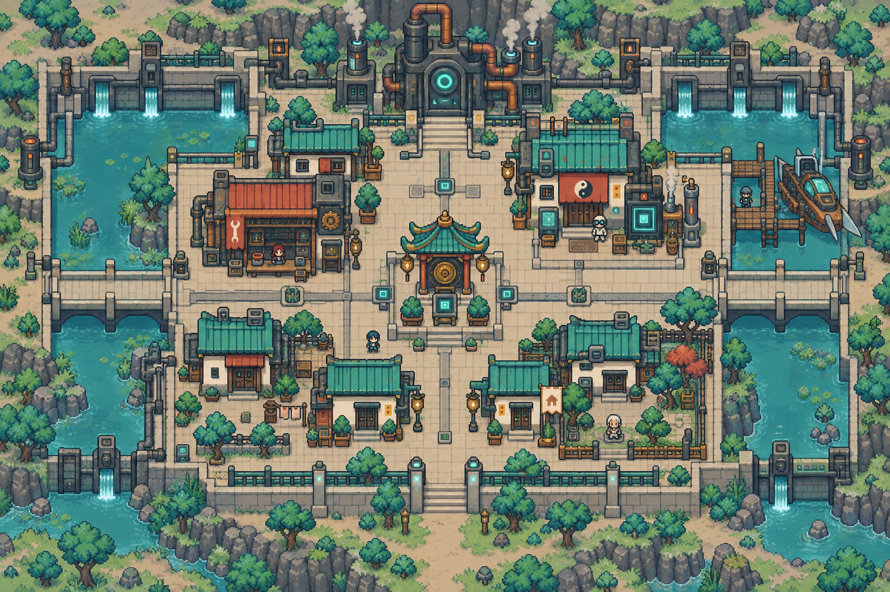
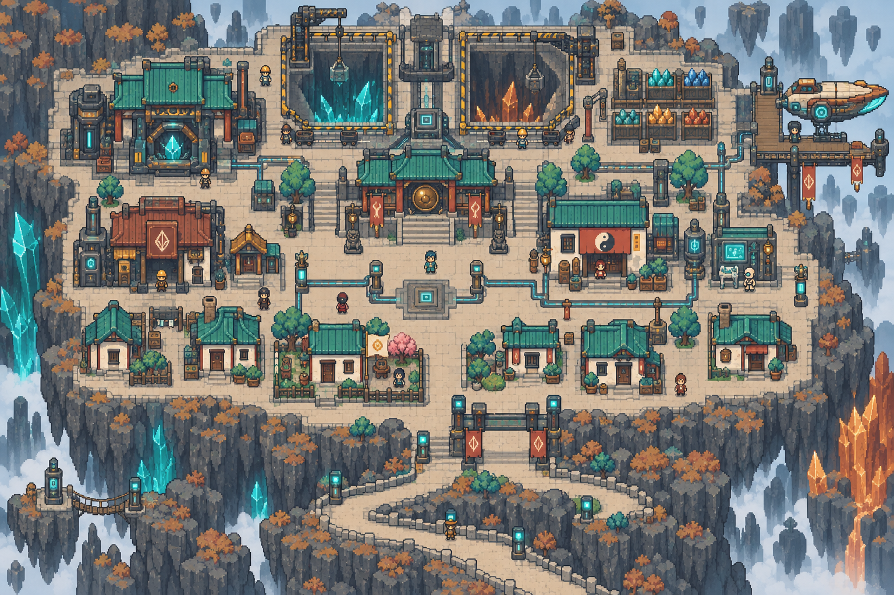

# 元素洪爐・完整地點配置

[返回索引](README.md)

## U-006-P1-C1｜鑄造城區

所屬：熾衡星。狀態：描述性模板；正式地名待定。

布局意圖：volcanic foundry city, contained amber furnace core north, teal cooling channels separating industrial blocks, three square bridges, southwest worker housing, southeast service market, central safe plaza。

住宅：一棟候選可購住宅，米色小旗、獨立門前通路；非所有建築可買。

## U-006-P1-C2｜冷卻城區

所屬：熾衡星。狀態：描述性模板；正式地名待定。

布局意圖：cooling town, long settling pools on west and east, central dry spine road, north pump house, southern homes, maintenance shops flanking square; short steam vents, no obscuring steam。

住宅：一棟候選可購住宅，米色小旗、獨立門前通路；非所有建築可買。

## U-006-P2-C1｜晶礦城區

所屬：碎晶星。狀態：描述性模板；正式地名待定。

布局意圖：crystal mining city on fractured mineral plateau, two square pits north with safe guardrails, color-sorted crystal bins east, west cutting hall, southern miner homes, broad switchback entry road。

住宅：一棟候選可購住宅，米色小旗、獨立門前通路；非所有建築可買。

## U-006-P2-C2｜重構城區

所屬：碎晶星。狀態：描述性模板；正式地名待定。

布局意圖：spatial reconstruction city, orthogonal street blocks on separate close stone platforms, four square modular bridges, alignment pillars, central assembly plaza, low houses on stable south block。

住宅：一棟候選可購住宅，米色小旗、獨立門前通路；非所有建築可買。

