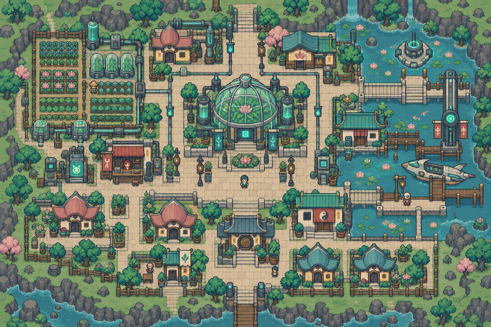
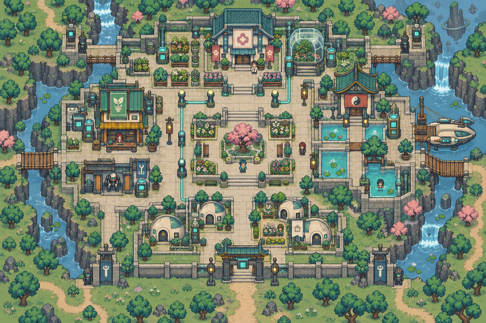
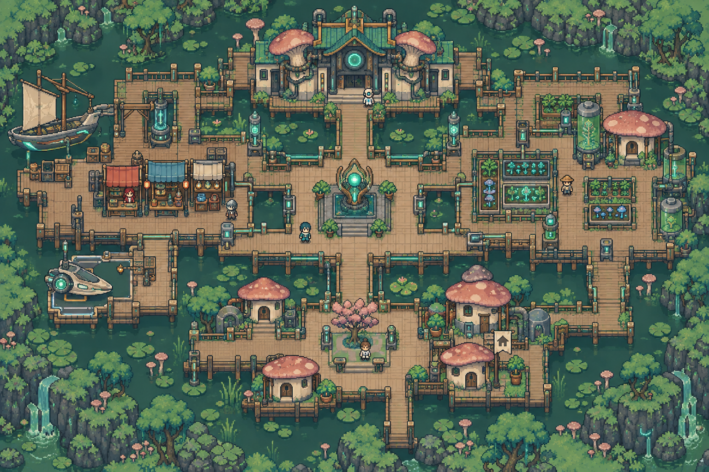
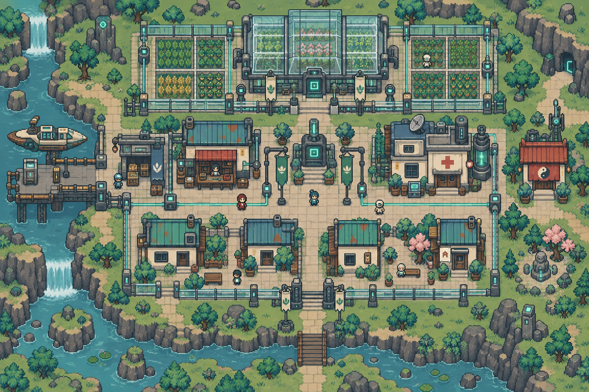

# 生化樂園・完整地點配置

[返回索引](README.md)

## U-007-P1-C1｜育生城區

所屬：華種星。狀態：描述性模板；正式地名待定。

布局意圖：biotech nursery city, petal roof pod houses, central propagation greenhouse, west seed beds, east shallow clean ponds, southern gardener residences, branching but grid-aligned cream paths。

住宅：一棟候選可購住宅，米色小旗、獨立門前通路；非所有建築可買。

## U-007-P1-C2｜療養城區

所屬：華種星。狀態：描述性模板；正式地名待定。

布局意圖：healing garden city, broad quiet courtyard with herb beds, small flower clinic north, therapy pools east, pharmacy west, pale pod homes south, two sheltered entrances。

住宅：一棟候選可購住宅，米色小旗、獨立門前通路；非所有建築可買。

## U-007-P2-C1｜共生城區

所屬：菌澤星。狀態：描述性模板；正式地名待定。

布局意圖：mycelium wetland city, square timber boardwalk loops around shallow dark green pools, mushroom-cap shelters, north symbiosis hall, east cultivation beds, west trade deck, south family pods。

住宅：一棟候選可購住宅，米色小旗、獨立門前通路；非所有建築可買。

## U-007-P2-C2｜隔離城區

所屬：菌澤星。狀態：描述性模板；正式地名待定。

布局意圖：quarantine cultivation city, glass partition fences dividing clear rectangular cultivation blocks, central check-in courtyard, north contained greenhouse, south staff homes, east clinic, separate west delivery entry。

住宅：一棟候選可購住宅，米色小旗、獨立門前通路；非所有建築可買。

