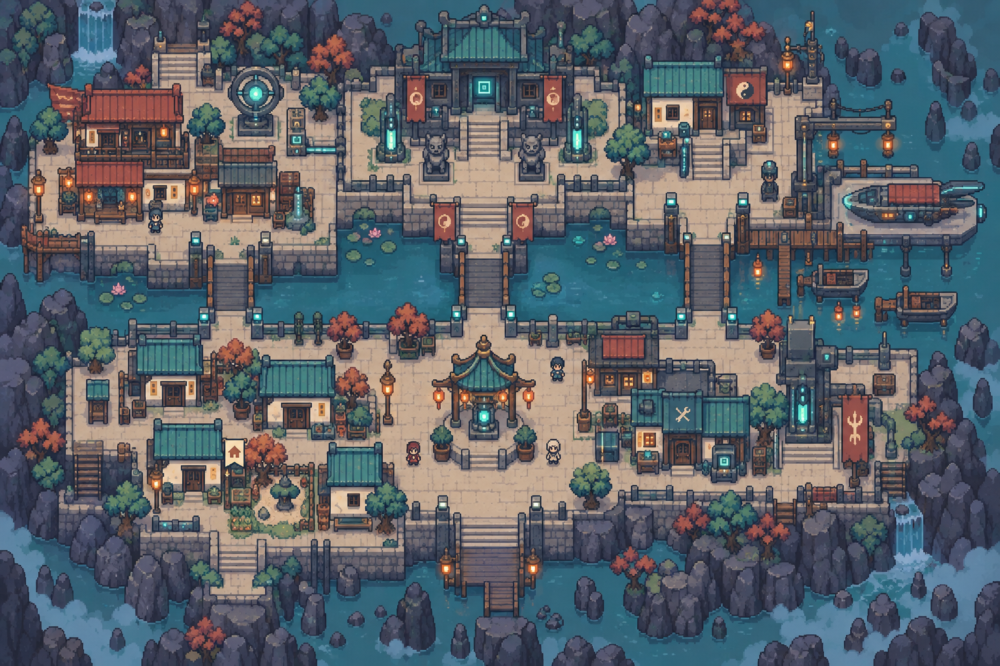
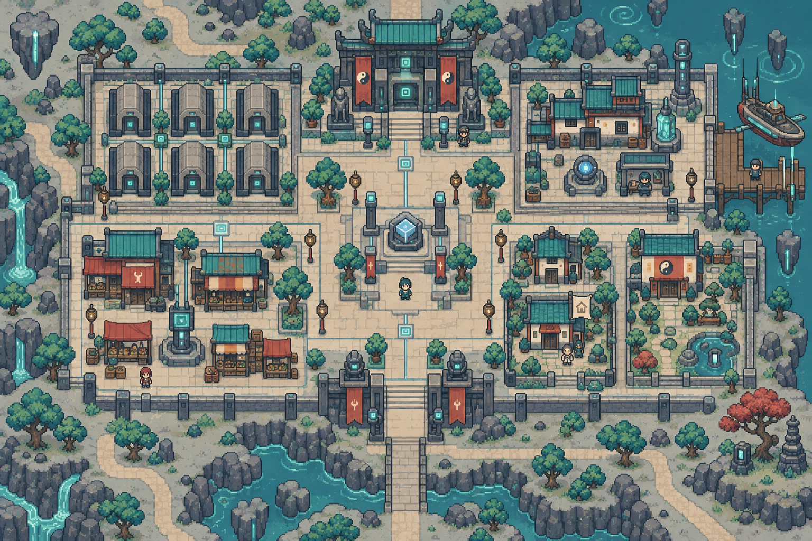
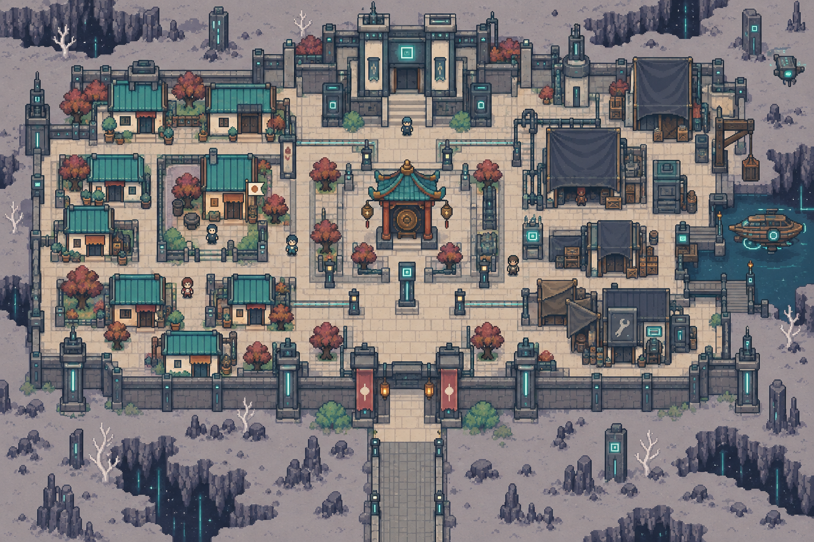

# 幽冥數據流・完整地點配置

[返回索引](README.md)

## U-008-P1-C1｜渡口城區

所屬：冥渡星。狀態：描述性模板；正式地名待定。

布局意圖：underworld ferry city, broad horizontal data canal and three short bridges, north record hall, east docks with small boats, west waiting houses, south homes and lantern square; readable dusk palette。

住宅：一棟候選可購住宅，米色小旗、獨立門前通路；非所有建築可買。

## U-008-P1-C2｜封存城區

所屬：冥渡星。狀態：描述性模板；正式地名待定。

布局意圖：sealed-memory archive city, rectangular rows of tombstone-like storage halls, central handover court, southeast custodian houses, southwest market, northern seal registry, quiet low walls and lantern roads。

住宅：一棟候選可購住宅，米色小旗、獨立門前通路；非所有建築可買。

## U-008-P2-C1｜除名城區

所屬：靜白星。狀態：描述性模板；正式地名待定。

布局意圖：erasure city on gray silent plain, missing signboards and covered doorways, staggered blind courtyards joined by clear passages, north blank registry, west homes, east shrouded storehouses, south gate。

住宅：一棟候選可購住宅，米色小旗、獨立門前通路；非所有建築可買。

## U-008-P2-C2｜舊魂聚落

所屬：靜白星。狀態：描述性模板；正式地名待定。

布局意圖：old-soul settlement, irregular small stone houses with warm lamps, central keepsake exchange plaza, north simple remembrance hall, west repaired memory cabinets, east gardens and south bridge entry。

住宅：一棟候選可購住宅，米色小旗、獨立門前通路；非所有建築可買。

