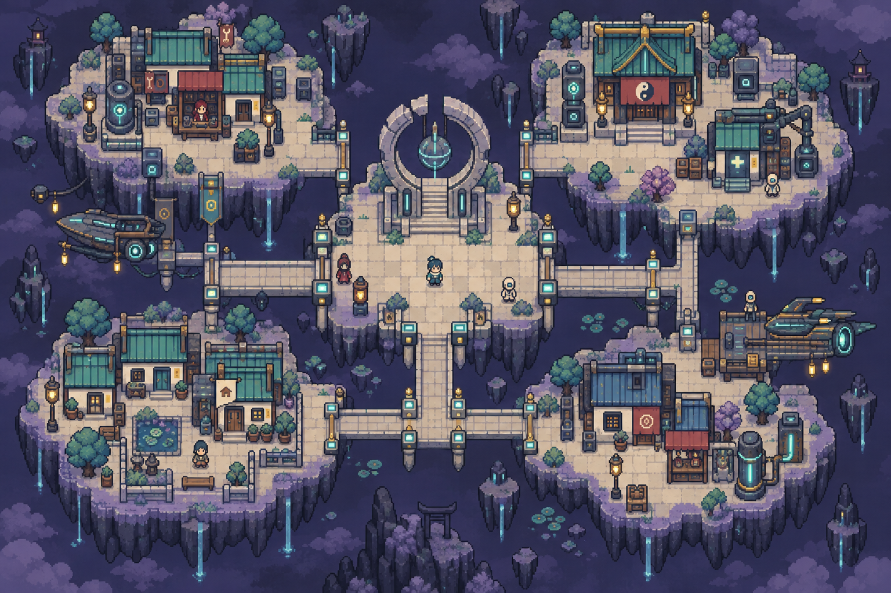
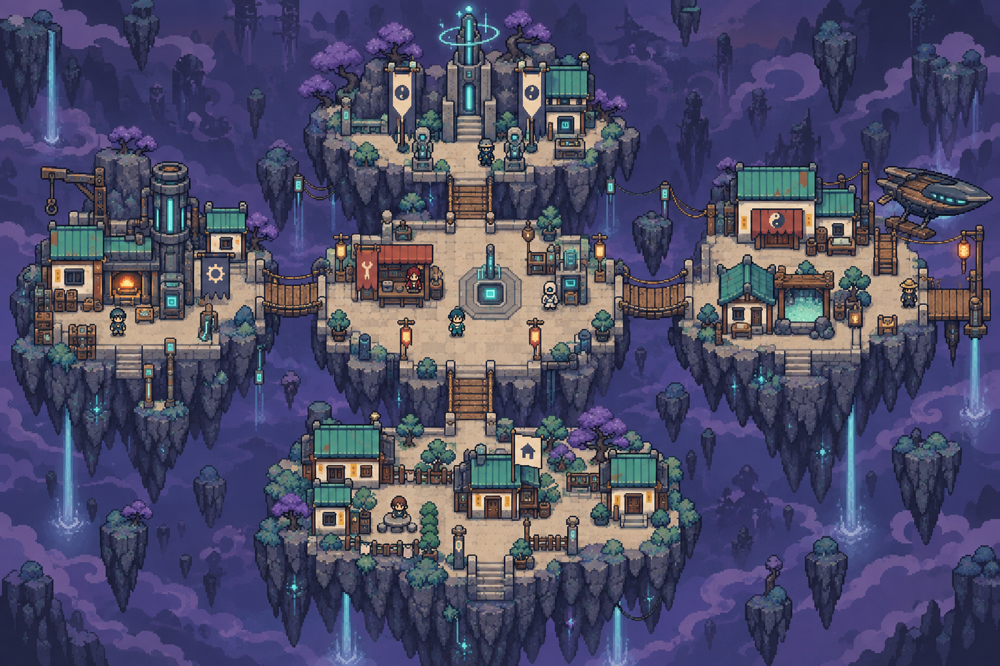
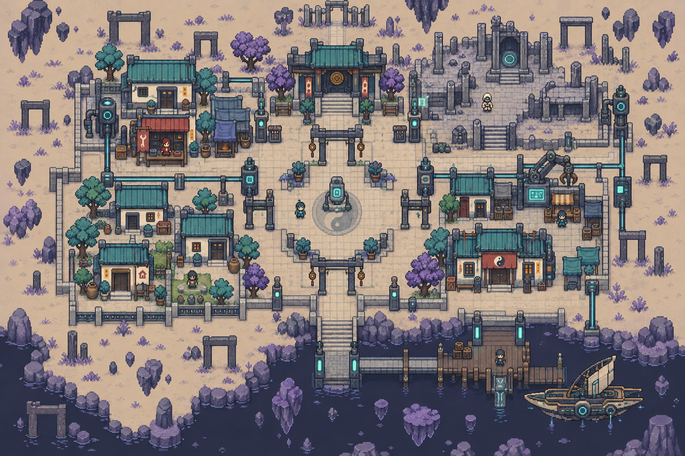
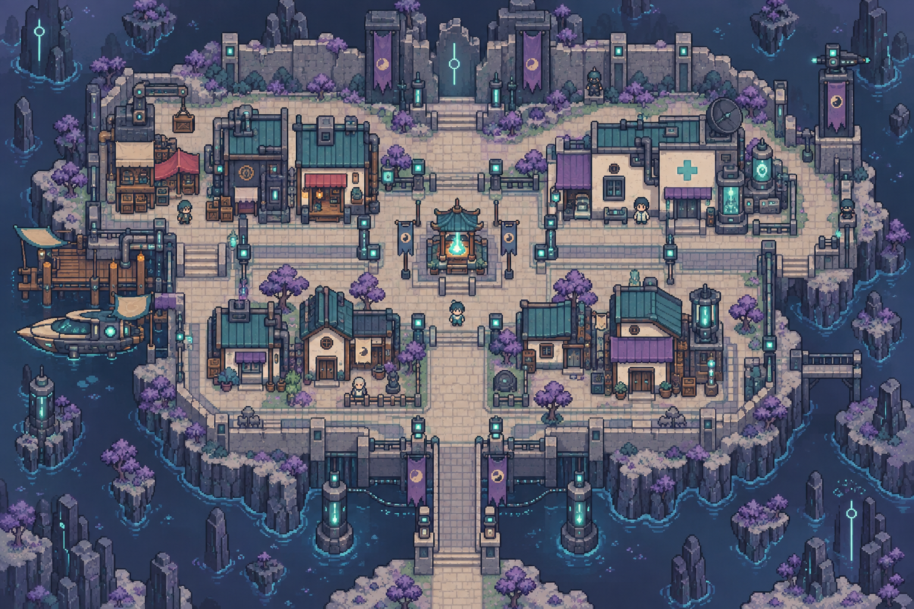

> **現行美術以[本次美術基準](../../worldbuilding/ART_BIBLE.md)為準。** 圖像保留為概念參考；本文涉及卡牌、獎勵、生成與遊戲流程的舊規格全部退役。人物與地理依世界觀統整。

# 深淵・完整地點配置

[返回索引](README.md)

## U-009-P1-C1｜守燈聚落

所屬：繫燈星。狀態：描述性模板；正式地名待定。

布局意圖：soul-lantern refuge city on fractured islands, broad central pale stone platform with broken circular arch, 4 connected smaller districts by square bridges, three shelters each, strong edge markings, warm safe homes。

住宅：一棟候選可購住宅，米色小旗、獨立門前通路；非所有建築可買。

## U-009-P1-C2｜繫橋聚落

所屬：繫燈星。狀態：描述性模板；正式地名待定。

布局意圖：bridge-tether settlement, chain of five close rocky platforms linked by short rope-and-stone bridges, north anchor tower, center supply square, east rest shelters, west lamp workshop, south homes。

住宅：一棟候選可購住宅，米色小旗、獨立門前通路；非所有建築可買。

## U-009-P2-C1｜回聲城區

所屬：回聲星。狀態：描述性模板；正式地名待定。

布局意圖：echo city on pale empty plain, repeating incomplete doorframes define neighborhoods, central empty courtyard, southwest inhabited low houses, northeast ruin halls, straight paths interrupt one repeating pattern。

住宅：一棟候選可購住宅，米色小旗、獨立門前通路；非所有建築可買。

## U-009-P2-C2｜避難城區

所屬：回聲星。狀態：描述性模板；正式地名待定。

布局意圖：abyss refuge city, compact enclosed safe island with warm cloth shelters, single communal hearth court, west supplies, east infirmary, north protective broken wall, south homes and one broad entry bridge。

住宅：一棟候選可購住宅，米色小旗、獨立門前通路；非所有建築可買。

