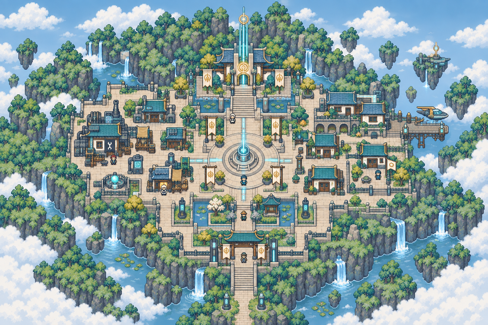
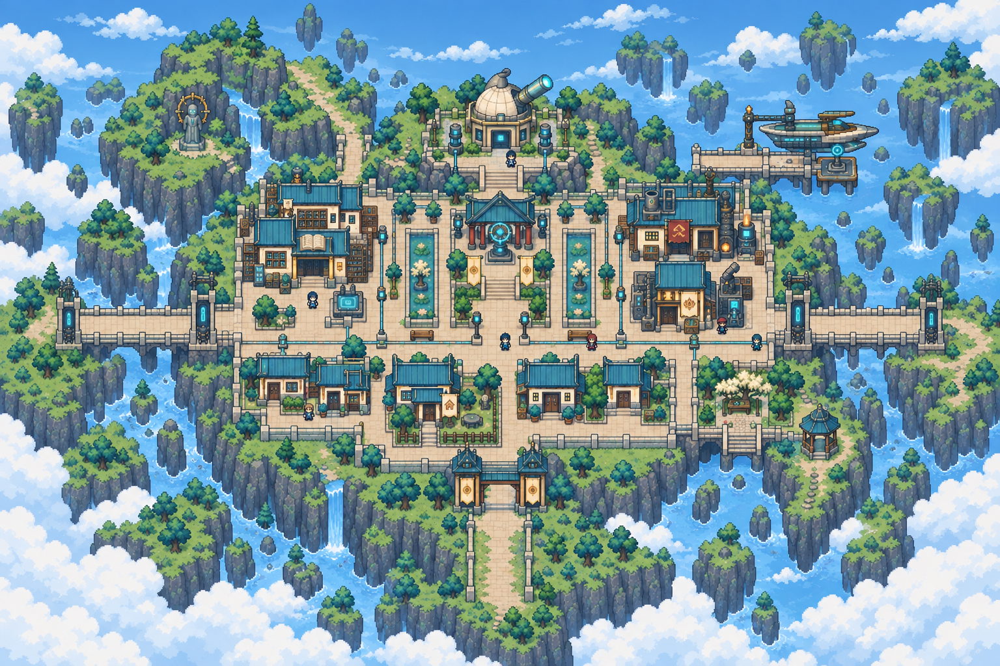
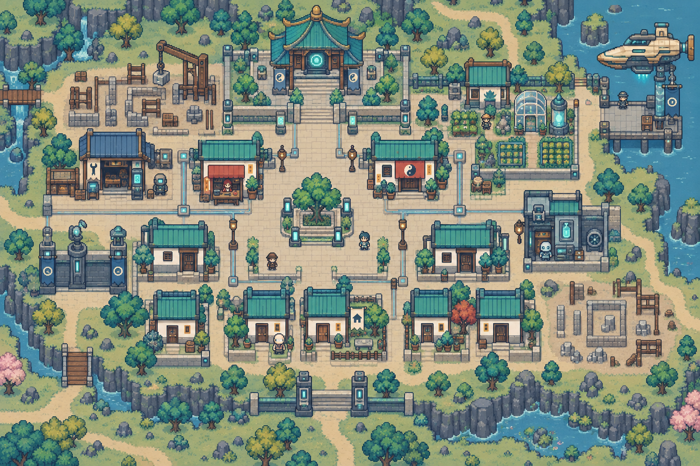
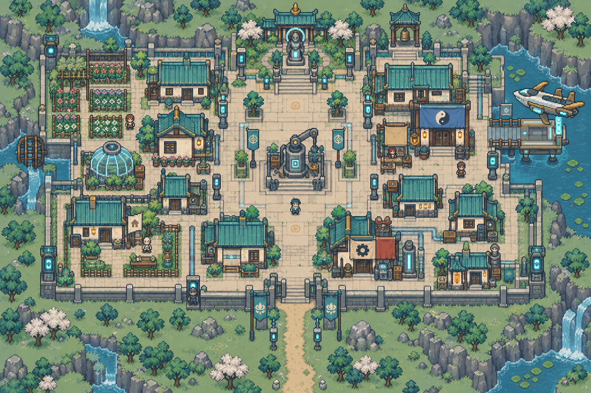

# 永恆聖堂・完整地點配置

[返回索引](README.md)

## U-010-P1-C1｜光井城區

所屬：晝庭星。狀態：描述性模板；正式地名待定。

布局意圖：luminous sanctuary city, circular stepped light well plaza, four orthogonal paths, north low sanctuary, west artisans, east arcaded houses, south gardens and gate; cream gold and mist blue。

住宅：一棟候選可購住宅，米色小旗、獨立門前通路；非所有建築可買。

## U-010-P1-C2｜書院城區

所屬：晝庭星。狀態：描述性模板；正式地名待定。

布局意圖：sanctuary academy city, three rectangular garden courts, north low observatory, west manuscript halls, east craft studios, south blue-window homes, shaded arcades and two gates。

住宅：一棟候選可購住宅，米色小旗、獨立門前通路；非所有建築可買。

## U-010-P2-C1｜初生城區

所屬：啟曦星。狀態：描述性模板；正式地名待定。

布局意圖：newborn city on warm dawn plain, neat but unfinished foundations beside completed cream houses, central sapling square, north small creation hall, west builders workshop, east gardens, south homes。

住宅：一棟候選可購住宅，米色小旗、獨立門前通路；非所有建築可買。

## U-010-P2-C2｜邊庭聚落

所屬：啟曦星。狀態：描述性模板；正式地名待定。

布局意圖：outer sanctuary garden town, modest pale timber houses, patchwork light-pattern paving, central repair court, north low shrine, west flower plots, east travelers lodge, south plain road entrance。

住宅：一棟候選可購住宅，米色小旗、獨立門前通路；非所有建築可買。

