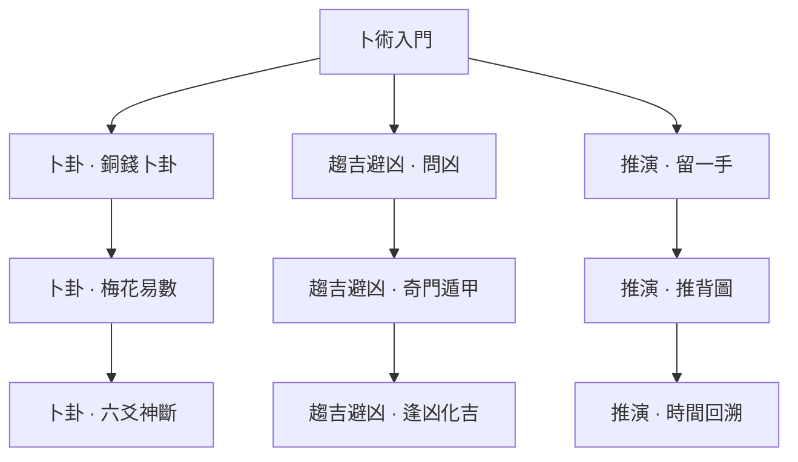

> **已退役：卡牌／技能樹／舊玩法美術草稿，非現行設計。** 現行方向見[世界觀與美術](../../worldbuilding/README.md)。

# 卜術｜預見、排序、預備應對

[返回五術總覽](README.md)

箭頭代表永久路徑的學習前置，實際卡牌仍需本輪取得。

圖版：左至右為「卜卦／趨吉避凶／推演」；上至下為入門、進階、終階。

## 卜卦｜牌頂排序，提高可預測性

| 階段 | 卡牌 | 氣／類型 | 效果 | 升級＋ |
|---|---|---|---|---|
| 入門 | 銅錢卜卦 | 1／技能 | 查看抽牌堆頂 3 張並排序；抽 1 張。 | 查看 4 張。 |
| 進階 | 梅花易數 | 1／技能 | 查看牌頂 1 張：攻擊則對單體造成 7 傷害，否則獲得 7 護體；牌留在頂端。 | 傷害或護體 10。 |
| 終階 | 六爻神斷 | 2／技能 | 查看並排序牌頂 5 張；抽 2 張。移除。 | 另獲得 4 護體。 |

## 趨吉避凶｜根據預告設置防備

| 階段 | 卡牌 | 氣／類型 | 效果 | 升級＋ |
|---|---|---|---|---|
| 入門 | 問凶 | 1／技能 | 若任一敵人本回合預告攻擊，獲得 9 護體；否則抽 2 張。 | 護體 12。 |
| 進階 | 奇門遁甲 | 1／技能 | 設一個預備：下一次受攻擊前獲得 8 護體，或下次出攻擊牌前使目標獲得 2 破綻。下個自己回合結束前有效。 | 護體 11；破綻不變。 |
| 終階 | 逢凶化吉 | 2／技能 | 獲得 12 護體；若本回合曾觸發預備，抽 2 張。 | 護體 16。 |

## 推演｜有限取回與預測獎勵

| 階段 | 卡牌 | 氣／類型 | 效果 | 升級＋ |
|---|---|---|---|---|
| 入門 | 留一手 | 1／技能 | 保留手中 1 張其他牌到下回合；獲得 5 護體。 | 護體 8。 |
| 進階 | 推背圖 | 1／技能 | 預測本回合下一張打出的其他牌類型；命中獲得 6 護體並抽 1 張。每回合限一次。 | 護體 9。 |
| 終階 | 時間回溯 | 2／技能 | 從棄牌堆取回 1 張本回合打出的費用不超過 1 的攻擊牌；費用不變。移除。 | 另獲得 4 護體；取回限制不變。 |

## 可跨世攜帶的仙術（另列，不占牌庫）

- **先兆 · 主動**：每場一次：查看並排序牌頂 2 張；不抽牌。
- **備卦 · 被動**：每場第一個預備觸發時獲得 3 護體。
