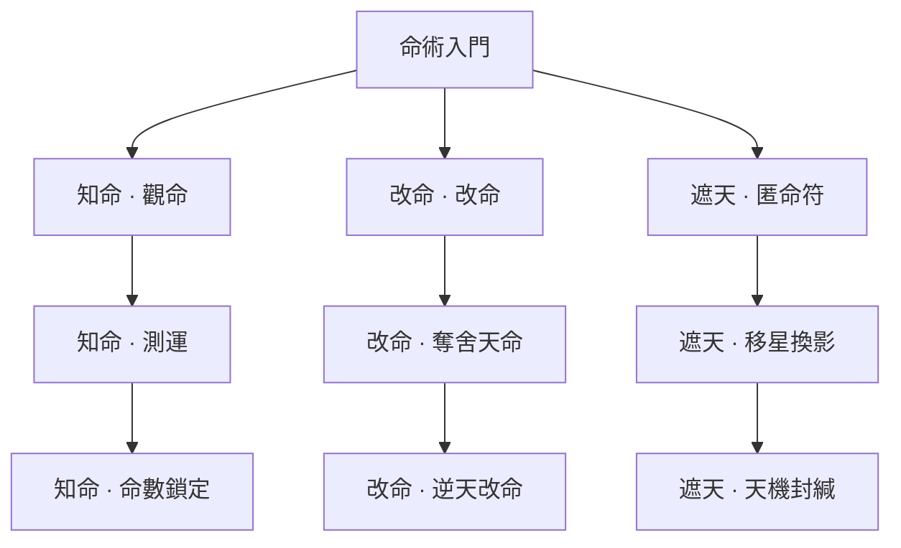

> **已退役：卡牌／技能樹／舊玩法美術草稿，非現行設計。** 現行方向見[世界觀與美術](../../worldbuilding/README.md)。

# 命術｜命印、轉移、因果代價

[返回五術總覽](README.md)

箭頭代表永久路徑的學習前置，實際卡牌仍需本輪取得。

圖版：左至右為「知命／改命／遮天」；上至下為入門、進階、終階。

## 知命｜標記目標，準備干涉

| 階段 | 卡牌 | 氣／類型 | 效果 | 升級＋ |
|---|---|---|---|---|
| 入門 | 觀命 | 1／技能 | 敵方單體獲得 2 命印；抽 1 張牌。 | 命印 3。 |
| 進階 | 測運 | 1／技能 | 敵方單體獲得 1 命印；每層命印使自己獲得 3 護體。 | 每層護體 4。 |
| 終階 | 命數鎖定 | 2／攻擊 | 造成 10 傷害；目標有至少 3 命印時另造成 8 傷害。 | 基礎傷害 14。 |

## 改命｜消耗命印換取強力結果

| 階段 | 卡牌 | 氣／類型 | 效果 | 升級＋ |
|---|---|---|---|---|
| 入門 | 改命 | 1／攻擊 | 消耗目標全部命印；造成 4＋每印 4 傷害。 | 基礎傷害 7。 |
| 進階 | 奪舍天命 | 2／技能 | 移除目標最多 12 護體；自己獲得同量護體；目標獲得 1 命印。 | 護體上限 16。 |
| 終階 | 逆天改命 | 3／技能 | 消耗目標 3 命印；取消該目標本回合一個已預告普通攻擊動作。移除；重大命運干涉事件＋1。精英以上僅減半該動作傷害。 | 費用 2。 |

## 遮天｜隱藏痕跡，調整戰鬥風險

| 階段 | 卡牌 | 氣／類型 | 效果 | 升級＋ |
|---|---|---|---|---|
| 入門 | 匿命符 | 1／技能 | 獲得 7 護體；若任一敵人有命印，再獲得 3 護體。 | 基礎護體 10。 |
| 進階 | 移星換影 | 1／技能 | 將敵方單體最多 3 命印移給另一敵人；僅一名敵人時改為該敵獲得 1 命印。抽 1 張。 | 獲得 3 護體。 |
| 終階 | 天機封緘 | 2／技能 | 獲得 14 護體；保留手中至多 2 張牌到下回合。移除；不降低世界擾動。 | 護體 18。 |

## 可跨世攜帶的仙術（另列，不占牌庫）

- **繫命 · 主動**：每場一次：給一名敵人 1 命印。
- **照命 · 被動**：每場首次攻擊有命印的目標時，額外造成 3 傷害。
