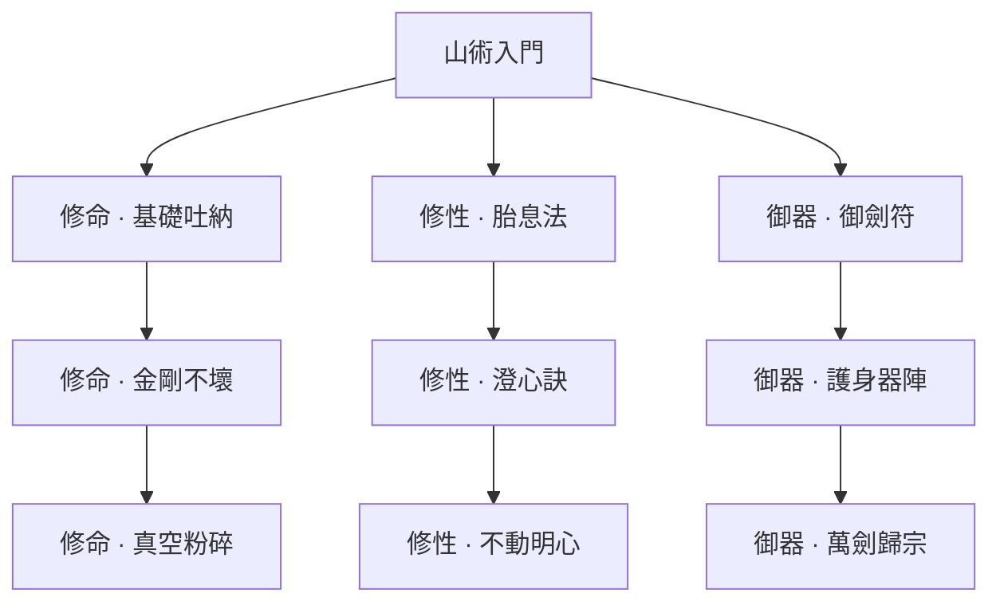
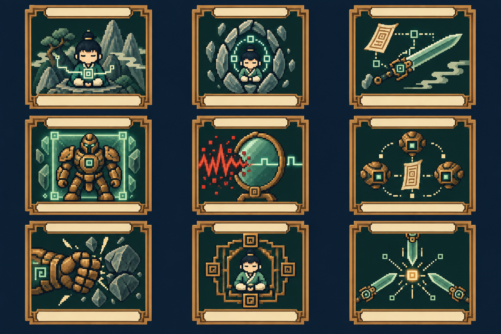

> **已退役：卡牌／技能樹／舊玩法美術草稿，非現行設計。** 現行方向見[世界觀與美術](../../worldbuilding/README.md)。

# 山術｜護體、蓄勢、御器

[返回五術總覽](README.md)

箭頭代表永久路徑的學習前置，實際卡牌仍需本輪取得。

圖版：左至右為「修命／修性／御器」；上至下為入門、進階、終階。

## 修命｜承受壓力，蓄勢反擊

| 階段 | 卡牌 | 氣／類型 | 效果 | 升級＋ |
|---|---|---|---|---|
| 入門 | 基礎吐納 | 1／技能 | 獲得 6 護體、1 蓄勢。 | 護體 9。 |
| 進階 | 金剛不壞 | 2／技能 | 獲得 16 護體、2 蓄勢。 | 護體 20。 |
| 終階 | 真空粉碎 | 2／攻擊 | 消耗全部蓄勢；造成 10＋每層 3 傷害。 | 基礎傷害 14。 |

## 修性｜以靜制動，保留防備

| 階段 | 卡牌 | 氣／類型 | 效果 | 升級＋ |
|---|---|---|---|---|
| 入門 | 胎息法 | 1／技能 | 獲得 5 護體；至下回合開始保留最多 8 護體。 | 保留上限 12。 |
| 進階 | 澄心訣 | 1／技能 | 移除自己 1 層虛弱；抽 1 張牌，獲得 4 護體。 | 護體 7。 |
| 終階 | 不動明心 | 2／能力 | 本戰每回合第一次打出山術技能牌後，獲得 3 護體。唯一。 | 每次 4 護體。 |

## 御器｜部署法器，攻守配合

| 階段 | 卡牌 | 氣／類型 | 效果 | 升級＋ |
|---|---|---|---|---|
| 入門 | 御劍符 | 1／攻擊 | 造成 6 傷害；獲得 1 劍印。 | 傷害 9。 |
| 進階 | 護身器陣 | 1／技能 | 消耗全部劍印；獲得 4＋每印 4 護體。 | 基礎護體 7。 |
| 終階 | 萬劍歸宗 | 2／攻擊 | 消耗全部劍印；對所有敵人造成 6＋每印 3 傷害。移除。 | 基礎傷害 9。 |

## 可跨世攜帶的仙術（另列，不占牌庫）

- **鎮岳 · 主動**：每場一次：獲得 8 護體；不耗氣。
- **定息 · 被動**：每場首回合獲得 4 護體。
