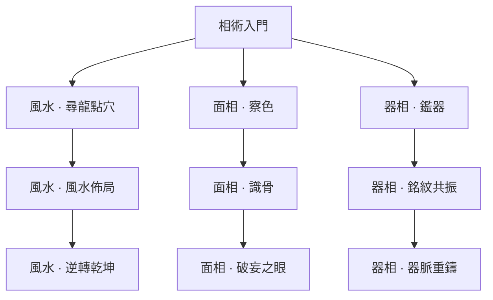

# 相術｜陣位、識破、器物共鳴

[返回五術總覽](README.md)

箭頭代表永久路徑的學習前置，實際卡牌仍需本輪取得。

圖版：左至右為「風水／面相／器相」；上至下為入門、進階、終階。

## 風水｜布陣後觸發連鎖

| 階段 | 卡牌 | 氣／類型 | 效果 | 升級＋ |
|---|---|---|---|---|
| 入門 | 尋龍點穴 | 1／技能 | 在空陣位放置「山」：立即獲得 4 護體。 | 護體 7。 |
| 進階 | 風水佈局 | 1／技能 | 在空陣位放置「水」並抽 1 張牌；無空位仍抽牌。 | 另獲得 3 護體。 |
| 終階 | 逆轉乾坤 | 2／攻擊 | 消耗全部陣位；每個陣位對所有敵人造成 4 傷害；山、水、火齊備再獲得 8 護體。 | 每位傷害 5。 |

## 面相｜識破破綻，集中打擊

| 階段 | 卡牌 | 氣／類型 | 效果 | 升級＋ |
|---|---|---|---|---|
| 入門 | 察色 | 1／技能 | 敵方單體獲得 2 破綻；獲得 4 護體。 | 護體 7。 |
| 進階 | 識骨 | 1／攻擊 | 造成 7 傷害；目標有破綻時抽 1 張牌。 | 傷害 10。 |
| 終階 | 破妄之眼 | 2／攻擊 | 移除目標最多 8 護體，再造成 12 傷害。 | 移除上限 12。 |

## 器相｜器物鑑識，補足陣法

| 階段 | 卡牌 | 氣／類型 | 效果 | 升級＋ |
|---|---|---|---|---|
| 入門 | 鑑器 | 1／技能 | 在空陣位放置「火」；獲得 3 護體。 | 護體 6。 |
| 進階 | 銘紋共振 | 1／技能 | 選一個已有陣位：山獲得 7 護體；水抽 2 張；火對單體造成 8 傷害。每回合限一次；不消耗陣位。 | 山 10／水不變／火 11。 |
| 終階 | 器脈重鑄 | 2／技能 | 將至多 2 個已有陣位轉為任選不同元素，不觸發放置效果；獲得 10 護體。 | 護體 14。 |

## 可跨世攜帶的仙術（另列，不占牌庫）

- **定盤 · 主動**：每場一次：在空陣位放置山；不觸發入場效果。
- **觀微 · 被動**：每場第一張施加破綻的卡額外施加 1 破綻。
