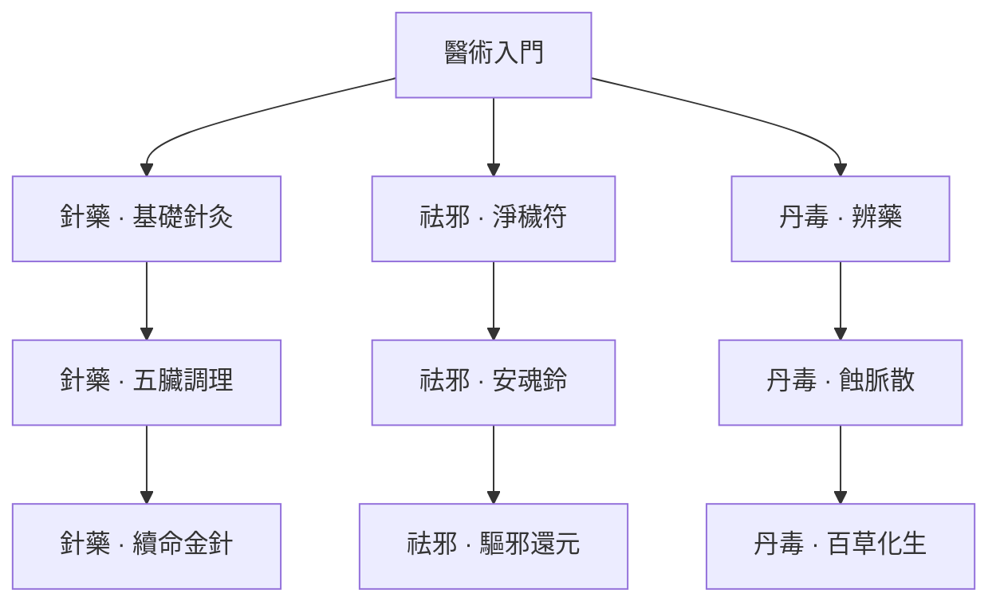

> **已退役：卡牌／技能樹／舊玩法美術草稿，非現行設計。** 現行方向見[世界觀與美術](../../worldbuilding/README.md)。

# 醫術｜治療、祛邪、丹毒

[返回五術總覽](README.md)

箭頭代表永久路徑的學習前置，實際卡牌仍需本輪取得。

圖版：左至右為「針藥／祛邪／丹毒」；上至下為入門、進階、終階。

## 針藥｜有限治療與淨化

| 階段 | 卡牌 | 氣／類型 | 效果 | 升級＋ |
|---|---|---|---|---|
| 入門 | 基礎針灸 | 1／技能 | 恢復 3 生命，獲得 3 護體。移除。 | 恢復 4 生命。 |
| 進階 | 五臟調理 | 1／技能 | 移除自己 1 層虛弱與 1 層中毒；獲得 1 藥引。 | 再獲得 4 護體。 |
| 終階 | 續命金針 | 2／技能 | 恢復 6 生命，獲得 8 護體。移除；不增加年齡上限、不復活。 | 護體 12。 |

## 祛邪｜清除異常，轉守為攻

| 階段 | 卡牌 | 氣／類型 | 效果 | 升級＋ |
|---|---|---|---|---|
| 入門 | 淨穢符 | 1／技能 | 移除自己最多 2 層中毒；獲得 5 護體。 | 護體 8。 |
| 進階 | 安魂鈴 | 1／技能 | 敵方單體獲得 2 層虛弱；獲得 1 藥引。 | 虛弱 3 層。 |
| 終階 | 驅邪還元 | 2／攻擊 | 造成 12 傷害；若本回合已淨化，另恢復 4 生命。移除。 | 傷害 16。 |

## 丹毒｜藥引轉化與持續傷害

| 階段 | 卡牌 | 氣／類型 | 效果 | 升級＋ |
|---|---|---|---|---|
| 入門 | 辨藥 | 1／技能 | 獲得 2 藥引；抽 1 張牌。 | 再獲得 3 護體。 |
| 進階 | 蝕脈散 | 1／技能 | 消耗最多 2 藥引；敵方單體獲得 2＋每份 2 層中毒。 | 基礎中毒 3 層。 |
| 終階 | 百草化生 | 2／技能 | 消耗全部藥引；每份恢復 2 生命、獲得 3 護體。移除。 | 每份護體 4。 |

## 可跨世攜帶的仙術（另列，不占牌庫）

- **回春 · 主動**：每場一次：恢復 4 生命；計入共同治療額度。
- **藥識 · 被動**：每場開始獲得 1 藥引。
