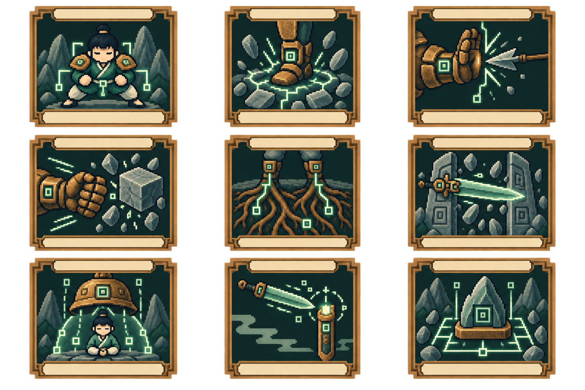
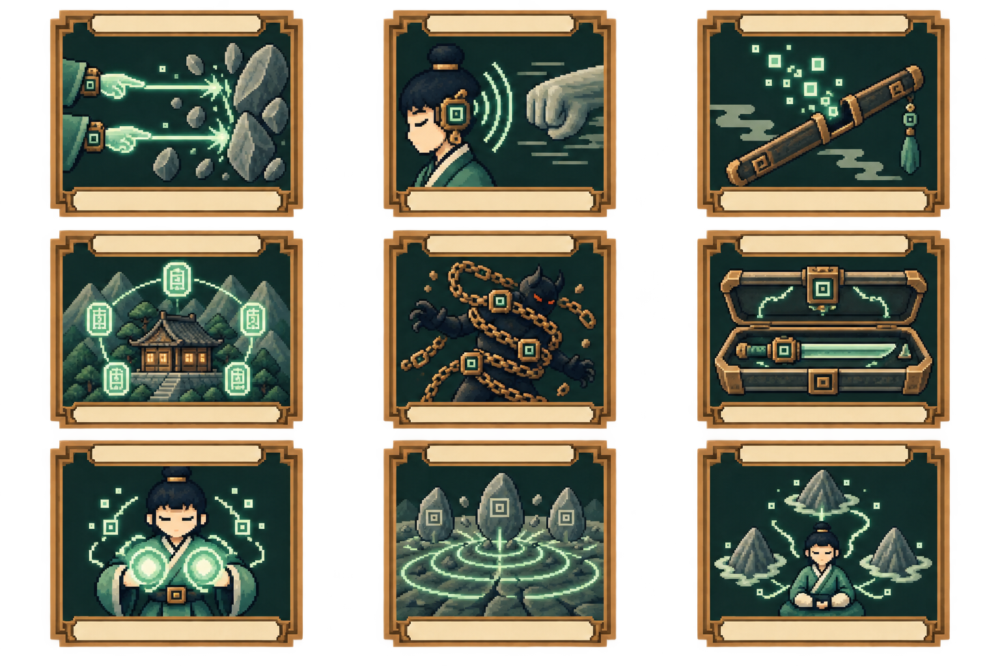

# 山術：45 張卡牌

[返回五術總覽](README.md) · [兩術搭配規則](../../design/CARD_PROGRESSION_BALANCE.md)

没有修行分支，所有卡都屬於山術。解鎖級別只是該術熟練度；效果標籤可自由混搭。

## 圖版 1｜熟練度 1 新增九張

| 格位 | ID／卡牌 | 氣／類型／稀有度 | 基礎效果 | 升級＋ |
|---|---|---|---|---|
| 1-1 | `fa3-shan-01` 基礎吐納 | 1／技能／普通 | 獲得 6 護體、1 蓄勢。 | 護體 9。 |
| 1-2 | `fa3-shan-02` 胎息法 | 1／技能／普通 | 獲得 5 護體；至下回合開始保留最多 8 護體。 | 保留上限 12。 |
| 1-3 | `fa3-shan-03` 御劍符 | 1／攻擊／普通 | 造成 6 傷害；獲得 1 劍印。 | 傷害 9。 |
| 2-1 | `fa3-shan-04` 金剛不壞 | 2／技能／進階 | 獲得 16 護體、2 蓄勢。 | 護體 20。 |
| 2-2 | `fa3-shan-05` 澄心訣 | 1／技能／進階 | 移除自己 1 層虛弱；抽 1 張牌，獲得 4 護體。 | 護體 7。 |
| 2-3 | `fa3-shan-06` 護身器陣 | 1／技能／進階 | 消耗全部劍印；獲得 4＋每印 4 護體。 | 基礎護體 7。 |
| 3-1 | `fa3-shan-07` 真空粉碎 | 2／攻擊／稀有 | 消耗全部蓄勢；造成 10＋每層 3 傷害。 | 基礎傷害 14。 |
| 3-2 | `fa3-shan-08` 不動明心 | 2／能力／稀有 | 本戰每回合第一次打出山術技能牌後，獲得 3 護體。唯一。 | 每次 4 護體。 |
| 3-3 | `fa3-shan-09` 萬劍歸宗 | 2／攻擊／稀有 | 消耗全部劍印；對所有敵人造成 6＋每印 3 傷害。移除。 | 基礎傷害 9。 |

## 圖版 2｜熟練度 2 新增九張

| 格位 | ID／卡牌 | 氣／類型／稀有度 | 基礎效果 | 升級＋ |
|---|---|---|---|---|
| 1-1 | `fa3-shan-10` 沉肩架 | 1／技能／普通 | 獲得 8 護體。 | 護體 11。 |
| 1-2 | `fa3-shan-11` 震步 | 1／攻擊／普通 | 造成 7 傷害；獲得 1 蓄勢。 | 傷害 10。 |
| 1-3 | `fa3-shan-12` 鐵袖 | 1／技能／普通 | 獲得 5 護體；抽 1 張。 | 護體 8。 |
| 2-1 | `fa3-shan-13` 崩拳 | 1／攻擊／普通 | 造成 8 傷害；有至少 2 蓄勢時追加 4 傷害，不消耗蓄勢。 | 基礎傷害 11。 |
| 2-2 | `fa3-shan-14` 盤根 | 1／技能／普通 | 獲得 4 護體；保留手中 1 張其他技能牌至下回合。 | 護體 7。 |
| 2-3 | `fa3-shan-15` 山門斬 | 2／攻擊／進階 | 造成 15 傷害；若本回合已獲得護體，追加 4 傷害。 | 基礎傷害 19。 |
| 3-1 | `fa3-shan-16` 銅鐘罩 | 2／技能／進階 | 獲得 18 護體；本回合不能再打出攻擊牌。 | 護體 23。 |
| 3-2 | `fa3-shan-17` 劍回鞘 | 1／技能／進階 | 消耗 1 劍印；抽 2 張，獲得 4 護體。 | 護體 7。 |
| 3-3 | `fa3-shan-18` 鎮岳印 | 2／技能／稀有 | 獲得 12 護體；至下回合開始保留最多 12 護體。移除。 | 護體及保留上限各 16。 |

## 圖版 3｜熟練度 3 新增九張

| 格位 | ID／卡牌 | 氣／類型／稀有度 | 基礎效果 | 升級＋ |
|---|---|---|---|---|
| 1-1 | `fa3-shan-19` 迎擊 | 1／攻擊／普通 | 造成 8 傷害；目標預告攻擊時，獲得 4 護體。 | 護體 7。 |
| 1-2 | `fa3-shan-20` 息壤壁 | 1／技能／普通 | 消耗 1 蓄勢；獲得 12 護體。 | 護體 16。 |
| 1-3 | `fa3-shan-21` 磨劍 | 1／技能／普通 | 獲得 2 劍印。 | 另獲得 3 護體。 |
| 2-1 | `fa3-shan-22` 擒鋒 | 1／攻擊／普通 | 造成 6 傷害；目標獲得 1 虛弱。 | 傷害 9。 |
| 2-2 | `fa3-shan-23` 小周天 | 1／技能／普通 | 獲得 4 護體與 1 蓄勢；移除自己 1 虛弱。 | 護體 7。 |
| 2-3 | `fa3-shan-24` 破甲錐 | 2／攻擊／進階 | 先移除目標最多 8 護體，再造成 12 傷害。 | 傷害 16。 |
| 3-1 | `fa3-shan-25` 借勢 | 1／技能／進階 | 消耗全部蓄勢；每層抽 1 張。 | 另獲得 3 護體。 |
| 3-2 | `fa3-shan-26` 御器封門 | 2／技能／進階 | 消耗全部劍印；獲得 8＋每印 5 護體。移除。 | 基礎護體 12。 |
| 3-3 | `fa3-shan-27` 不壞真形 | 3／能力／稀有 | 唯一；本戰每回合第一次消耗蓄勢後，獲得 6 護體。 | 護體 8。 |

## 圖版 4｜熟練度 4 新增九張

| 格位 | ID／卡牌 | 氣／類型／稀有度 | 基礎效果 | 升級＋ |
|---|---|---|---|---|
| 1-1 | `fa3-shan-28` 碎岩指 | 1／攻擊／普通 | 造成 5 傷害兩次。 | 每次傷害 6。 |
| 1-2 | `fa3-shan-29` 聽勁 | 1／技能／普通 | 獲得 6 護體；若任一敵人預告攻擊，再獲得 1 蓄勢。 | 護體 9。 |
| 1-3 | `fa3-shan-30` 空鞘 | 1／技能／普通 | 失去全部劍印；獲得 6 護體並抽 1 張。 | 護體 9。 |
| 2-1 | `fa3-shan-31` 結廬守心 | 1／技能／普通 | 獲得 5 護體；手中每張其他山術牌再獲得 1 護體，最多追加 5。 | 基礎護體 8。 |
| 2-2 | `fa3-shan-32` 纏鐵索 | 1／技能／普通 | 目標獲得 1 虛弱與 1 破綻。 | 破綻 2。 |
| 2-3 | `fa3-shan-33` 劍匣齊鳴 | 2／攻擊／進階 | 對所有敵人造成 9 傷害；獲得 1 劍印。 | 傷害 12。 |
| 3-1 | `fa3-shan-34` 斂氣待發 | 1／技能／進階 | 獲得 2 蓄勢；本回合下一張攻擊牌費用加 1。 | 另獲得 4 護體。 |
| 3-2 | `fa3-shan-35` 撼地 | 2／攻擊／進階 | 消耗全部蓄勢；對所有敵人造成 5＋每層 3 傷害。 | 基礎傷害 8。 |
| 3-3 | `fa3-shan-36` 萬岳歸身 | 3／技能／稀有 | 獲得 25 護體；蓄勢設為 3。移除。 | 護體 30。 |

## 圖版 5｜熟練度 5 新增九張

| 格位 | ID／卡牌 | 氣／類型／稀有度 | 基礎效果 | 升級＋ |
|---|---|---|---|---|
| 1-1 | `fa3-shan-37` 洗劍 | 1／技能／普通 | 消耗 1 劍印；移除自己最多 2 虛弱，獲得 8 護體。 | 護體 11。 |
| 1-2 | `fa3-shan-38` 斷流掌 | 1／攻擊／普通 | 造成 9 傷害；若本回合已消耗蓄勢，目標獲得 1 虛弱。 | 傷害 12。 |
| 1-3 | `fa3-shan-39` 抱元 | 1／技能／普通 | 獲得 5 護體；若沒有蓄勢，獲得 2 蓄勢。 | 護體 8。 |
| 2-1 | `fa3-shan-40` 藏鋒步 | 1／技能／普通 | 獲得 7 護體；若有劍印，保留手中 1 張其他攻擊牌至下回合。 | 護體 10。 |
| 2-2 | `fa3-shan-41` 石心 | 1／技能／普通 | 移除自己 1 破綻；獲得 7 護體。 | 護體 10。 |
| 2-3 | `fa3-shan-42` 飛劍穿雲 | 2／攻擊／進階 | 消耗 1 劍印；造成 18 傷害，無視護體。 | 傷害 22。 |
| 3-1 | `fa3-shan-43` 氣返山河 | 2／技能／進階 | 消耗全部蓄勢；獲得 6＋每層 4 護體，抽 1 張。 | 基礎護體 10。 |
| 3-2 | `fa3-shan-44` 三器合璧 | 2／技能／進階 | 消耗 3 劍印；獲得 15 護體，抽 2 張。移除。 | 護體 20。 |
| 3-3 | `fa3-shan-45` 一劍開山 | 3／攻擊／稀有 | 消耗 3 劍印；造成 32 傷害。移除。 | 傷害 40。 |

## 與生俱來的仙術（另列，不算卡牌）

獲得後所有輪迴開局都有；不受兩術選擇或攜帶欄位限制。

- **鎮岳／主動**：每場一次：獲得 8 護體；不耗氣。
- **定息／被動**：每場首回合獲得 4 護體。
