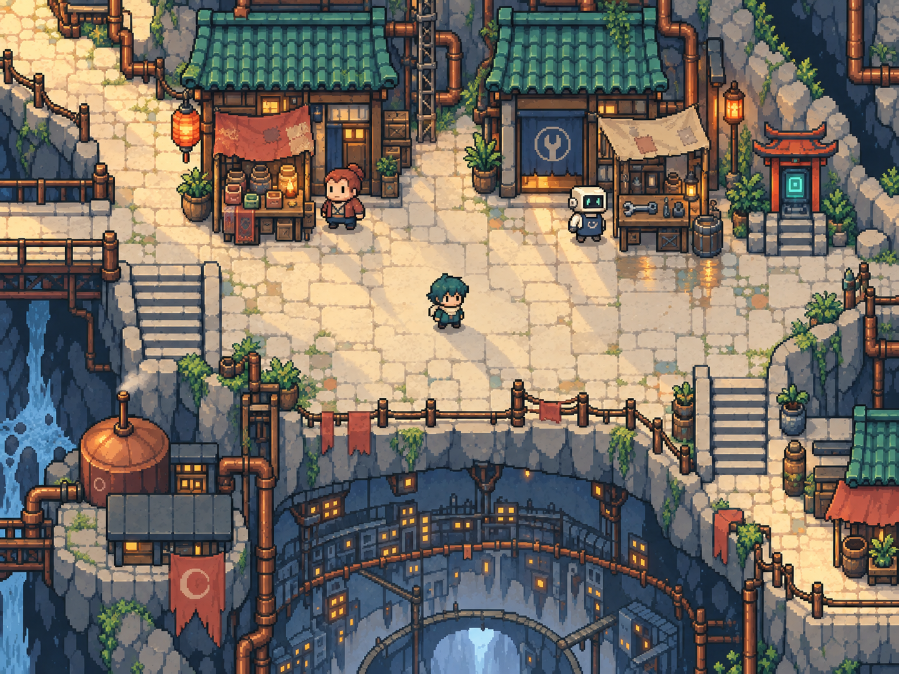

# 復古像素，現代製作精度

使用者確認的方向：人物小巧、大頭短身，像素外觀清楚；場景與角色有精緻細節，並非受舊硬體限制。製作仍使用Blender與Godot，故事和素材先分開完成，再接入遊戲。

本張以既有街區配置為參考，內建imagegen生成；主角、紅與機器人拾六維持相近地圖比例。拾六及其事件仍是故事提案，圖片不使其自動變成已定案人物。完整[提示詞與檢視紀錄](PROMPTS.md)。

## 精緻度放在哪裡

角色保留深青道袍、米白圍巾、磚紅外套與機械眼等醒目辨識點，再用接縫、布料分層和少量高光區別材質。對話肖像可以呈現更多細節，地圖小人則用姿態與動作表現性格。

店鋪增加有使用原因的物件：常拿的工具靠近工作手、脆弱貨物收在棚下、修補布和管線接頭有磨耗。窗光與積水反射須有對應光源。場景不平均鋪滿裂紋，行走區與人物後方保持較低對比。

## 動作製作清單（尚未實作）

| 對象 | 基本動作 | 生活細節 | 技術邊界 |
|---|---|---|---|
| 主角 | 四方向待機、行走、轉身 | 呼吸、圍巾隨步幅擺動、注視交談者 | 原地呼吸不造成腳底漂移 |
| 紅 | 四方向行走、交談 | 清點貨物、收攤、扶正舊燈 | 手與貨品對位，角色遮擋不穿桌 |
| 拾六 | 四方向移動、停下轉頭 | 抱包裹、工具手接合、眼屏表情 | 機械節奏有個性，不讓每個機器人都像故障 |
| 店鋪 | 窗光與燈籠狀態 | 布棚輕擺、蒸氣、植物 | 大量同類動畫錯開節拍，支援降低動態 |
| 天候 | 雨雪、地面濕度與風 | 簷滴、腳步水紋、積雪退融 | 室內及棚下不直接下雨，不遮住交談者 |

幀數與播放速度依試作決定，不以更多幀數自動等於品質。地磚、角色和特效使用一致的顯示像素密度；素材提升解析度時同步調整其他層，不能只讓人物變得過細。

## 交付狀態

已完成新版靜態概念PNG、提示詞和動作規格。尚未製作透明精靈、行走動畫、地磚、.blend檔或Godot場景。此圖含景深空間構圖但不使用鏡頭模糊；正式場景的遮擋、碰撞與可走邊界仍須重建。

季節與天氣另見[設計規格](../../worldbuilding/SEASONS_AND_WEATHER.md)。
