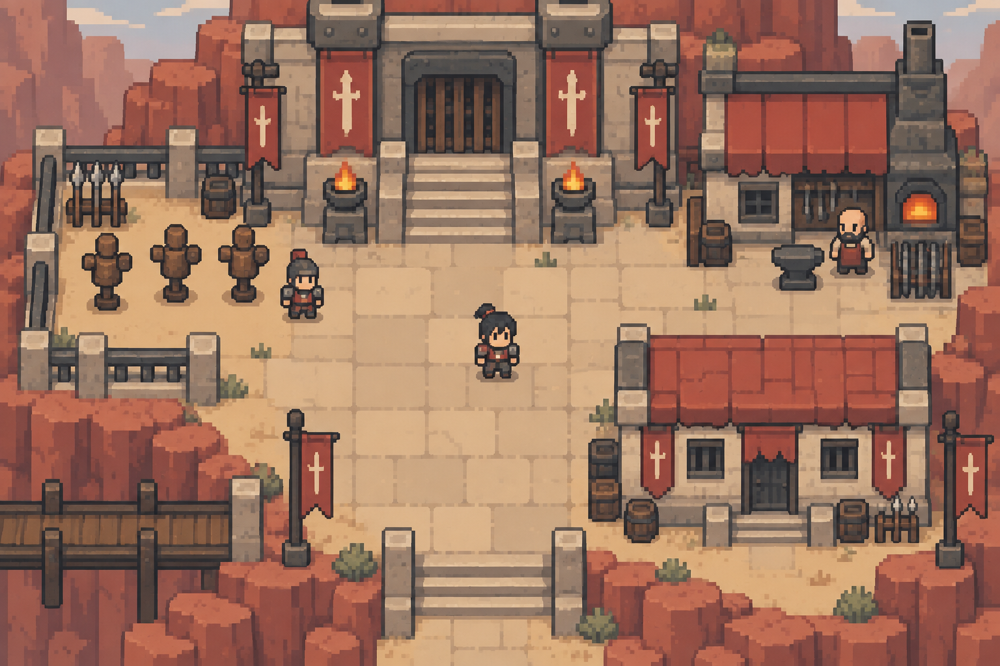
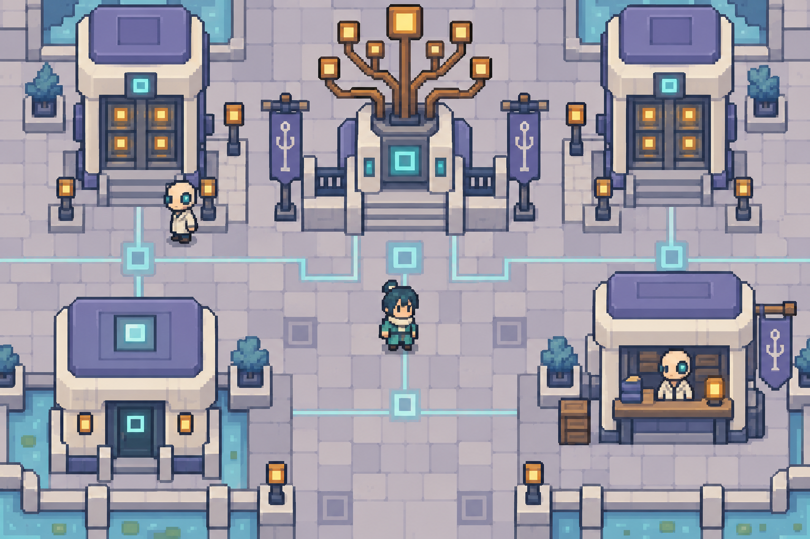
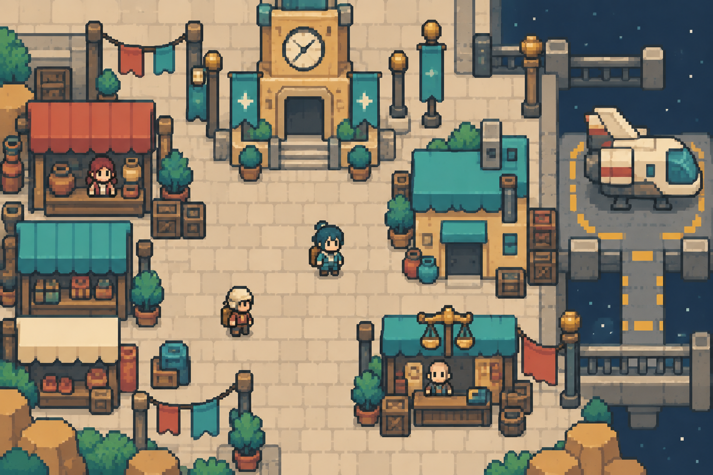
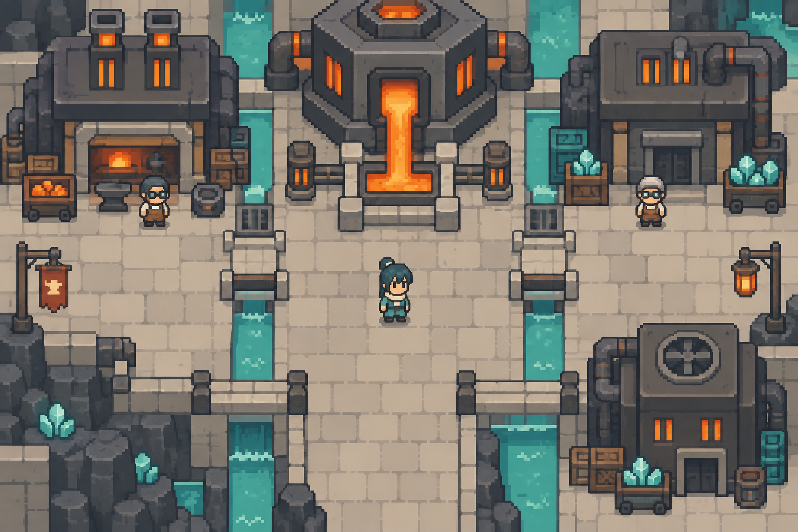
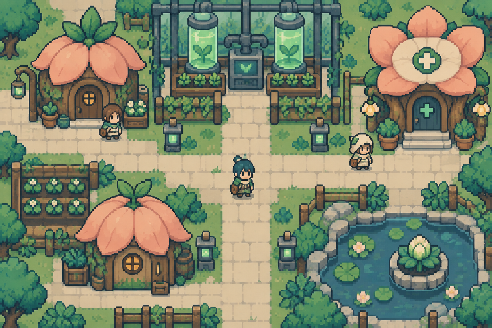
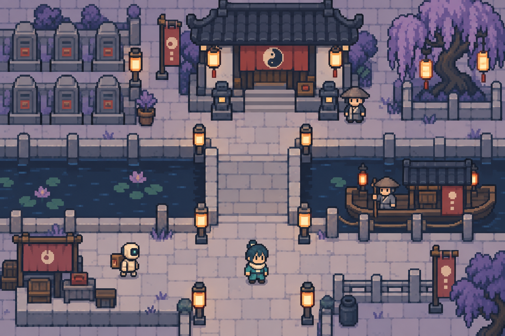
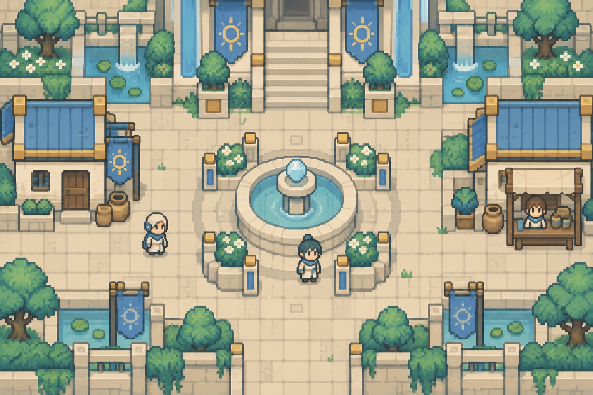

# 十大宇宙主視覺圖鑑

美術方向已由使用者選定：**GBA 時代、俯視、小比例人物、清楚像素色塊**。宇宙骨架依使用者提供的分享對話；造型與環境變體是本次設計。

[世界觀基準與來源](SOURCES.md) · [卡牌與道具](../cards-items/README.md) · [五術職業與修行樹](../cards-items/FIVE_ARTS.md) · [房產與跨輪迴舊居](../../design/HOUSING_AND_REINCARNATION.md) · [離線圖鑑](gallery.html)

本次包含 10 張宇宙代表場景（沿用已選定的歸墟圖，另生成 9 張），20 個星球環境位置、40 個城市／聚落／街區視覺模板。模板不是完整正式地名名單；沒有來源依據的地名不自行宣布為正史。宇宙主視覺代表一個街區；後續已完成[40 張完整地點配置圖](../cities/README.md)，每張示範一個可拆分區塊的布局。

| 宇宙 | 大道／法則 | 主視覺 | 輪廓差異 |
|---|---|---|---|
| [U-001 歸墟](u-001.md) | 始／命運 | 廢土裡重新開始的人間街坊 | 不對稱補丁、短鐵皮屋頂、方形舊入口 |
| [U-002 武神界](u-002.md) | 力／因果 | 把力量刻在城牆上的武道文明 | 厚階梯、矩形堡門、寬柱、低重心 |
| [U-003 神經網](u-003.md) | 知／輪迴 | 記憶沿著城市的神經流動 | 分枝線路、成對節點、圓角機櫃 |
| [U-004 智械天庭](u-004.md) | 序／生命 | 以機械秩序管理生命的天庭 | 嚴格軸線、等距方格、階梯宮闕 |
| [U-005 星際商盟](u-005.md) | 利／時間 | 每一個泊位與鐘聲都有價格 | 貨箱模組、短拱棚、橫向碼頭 |
| [U-006 元素洪爐](u-006.md) | 變／空間 | 物質與空間持續被重新鍛造 | 六角爐口、斷面岩台、可重組方橋 |
| [U-007 生化樂園](u-007.md) | 生／真實 | 自然生長與人工生命難分彼此 | 花瓣屋頂、種莢房舍、圓形培養槽 |
| [U-008 幽冥數據流](u-008.md) | 終／遮天 | 亡者資料在河岸等待最後交接 | 低拱橋、墓碑機櫃、狹長渡口 |
| [U-009 深淵](u-009.md) | 空／靈魂 | 虛無中仍有人為靈魂留下一盞燈 | 缺角石台、斷拱、大片留白與孤立連橋 |
| [U-010 永恆聖堂](u-010.md) | 光／創世 | 創造秩序的光照進可居住的聖城 | 矮拱廊、放射紋、階梯庭院、圓形光井 |

## 共用畫風

- 16×16 px 地磚、16×24 px 二頭身地圖角色是製作目標；以 320×180 場景畫布起測，UI 另層處理中文。
- 像素密度、腳底基準、固定光向、取樣方式一致。每材質 2～3 階明暗；主要道路與背景有明確差異。
- 以形狀＋材質＋地貌區分宇宙，色盤只是其中一層。不能把同一組民宅換色就稱為新宇宙。
- 神經網重「節點與分枝」、智械天庭重「軸線與宮闕」、生化樂園重「種莢與培育」。幽冥有資料河、深淵有空隙與斷台；武神有堡壘、洪爐有工業爐體。
- 同一宇宙的第二顆星球更換地表和氣候；同星球的城市更換功能與地標。保留宇宙的核心輪廓及文明材質。
- 世界變動率上升以命線斷續、觀察者標記、警戒燈等可關閉特效提示，不靠過度閃爍或降低道路可見度。

## 圖片總覽

### U-001 歸墟

既有蔓哈頓深坑星・破爛一條街；廢土裡重新開始的人間街坊。詳見 [規格](u-001.md)。

### U-002 武神界

未命名武道城・演武廣場（視覺提案）；把力量刻在城牆上的武道文明。詳見 [規格](u-002.md)。

### U-003 神經網

未命名記憶城・節點廣場（視覺提案）；記憶沿著城市的神經流動。詳見 [規格](u-003.md)。

### U-004 智械天庭

未命名天庭城・登錄廣場（視覺提案）；以機械秩序管理生命的天庭。詳見 [規格](u-004.md)。

### U-005 星際商盟

未命名商港・交易廣場（視覺提案）；每一個泊位與鐘聲都有價格。詳見 [規格](u-005.md)。

### U-006 元素洪爐

未命名鑄造城・冷卻廣場（視覺提案）；物質與空間持續被重新鍛造。詳見 [規格](u-006.md)。

### U-007 生化樂園

未命名育生城・溫室街坊（視覺提案）；自然生長與人工生命難分彼此。詳見 [規格](u-007.md)。

### U-008 幽冥數據流

未命名幽冥城・資料渡口（視覺提案）；亡者資料在河岸等待最後交接。詳見 [規格](u-008.md)。

### U-009 深淵

未命名裂隙聚落・守燈石台（視覺提案）；虛無中仍有人為靈魂留下一盞燈。詳見 [規格](u-009.md)。

### U-010 永恆聖堂

未命名聖堂城・光井庭院（視覺提案）；創造秩序的光照進可居住的聖城。詳見 [規格](u-010.md)。

## Blender 與 Godot 交接

建築／道具用 Blender 模組底稿、固定正交鏡頭及光向，低解析度渲染後清理像素；人物與小圖示可直接像素繪製。遊戲素材建議分為 ground、facade、roof、props、fx，碰撞與導航獨立配置。先驗證歸墟一個街區，再擴充新宇宙。

所有生成圖皆為概念圖，不是嚴格格網、索引色、透明圖集，也不包含 .blend 工程或 Godot 場景。仍需去除局部柔光、統一像素尺度、簡化地面紋理。卡片文字必須保留可編輯層。

## 生成紀錄

工具：內建 imagegen。九張新宇宙圖皆以使用者已選定的歸墟圖作風格參考。完整提示詞見 [PROMPTS.md](PROMPTS.md)。本次不變更現有遊戲行為。

## 城市住宅預留

每個宇宙可以有多顆星球，現有 20 個環境位置與 40 個地點模板不是數量上限。後續完整城市配置圖各預留一個有道路連通的候選住宅及 NPC 來訪空間；墓園、工業區等依環境使用守門小屋、宿舍或避難居所。購屋、來訪條件和跨輪迴記憶以[房屋系統設計](../../design/HOUSING_AND_REINCARNATION.md)為準。候選住宅標記不代表所有建築均可購買或已完成室內。
