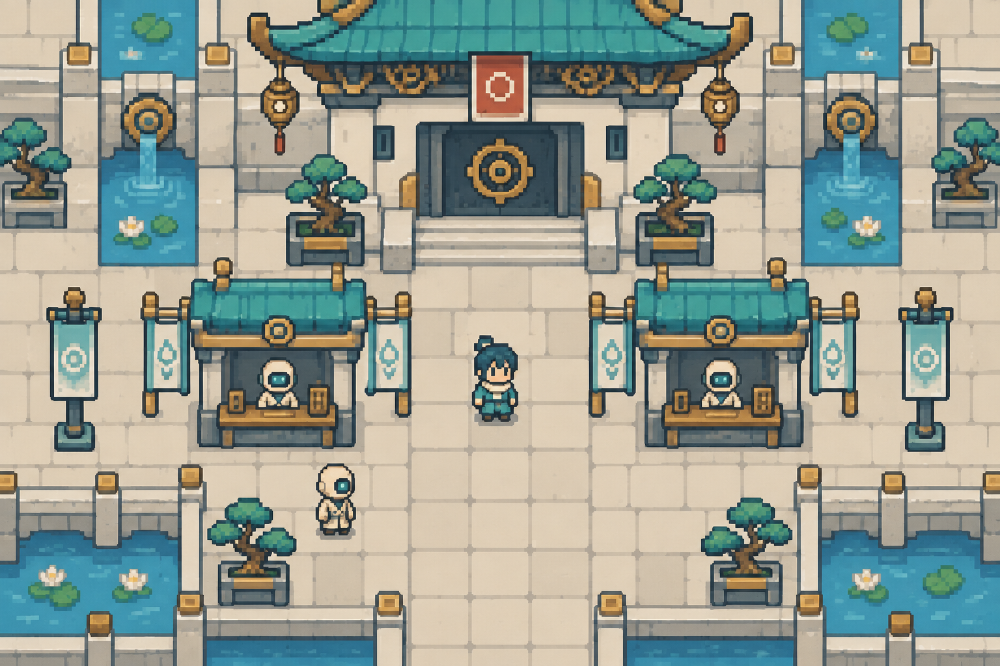

# U-004 智械天庭｜GBA 像素主視覺

[返回總覽](README.md) · [世界觀來源](SOURCES.md)

道主：玉皇 Prime；大道：序；法則：生命。名稱與對應沿用來源；以下場景造型為本次新增美術設計。

**以機械秩序管理生命的天庭。**

畫面位置：未命名天庭城・登錄廣場（視覺提案）。這是宇宙的代表街區視覺，非整顆星球鳥瞰，也不表示其他城市使用相同布局。

## 視覺語言

| 項目 | 規格 |
|---|---|
| 建築輪廓 | 嚴格軸線、等距方格、階梯宮闕 |
| 材質 | 白釉金屬、磨砂鋼、黃銅、玉色面板 |
| 地貌 | 人工平台、整齊水渠、分層機械宮城 |
| 標誌地標 | 對稱機械宮門與生命登錄終端 |
| 居民 | 制服式袍服、方帽機械吏員、整齊機械步伐 |
| 像素動態 | 等間距指示燈、門扉機械開合 |
| 避免 | 滿畫面飄浮光柱；把白色城區做得無法辨路 |

基礎色盤（順序為深色／主色／輔色／亮色或地表／點綴的設計組合，實際語義依材質分配）：`#344958`、`#DCE2D9`、`#7CAEB6`、`#C2A259`、`#AA5748`。這些是製作目標色，生成概念圖未做嚴格索引色驗證，不宣稱其像素完全符合色碼。

## 星球與城市延伸

### U-004-P1 未命名星球 A（提案）

地貌：人工玉白平台。

| 地點代碼 | 類型與視覺規格 | 狀態 |
|---|---|---|
| U-004-P1-C1 | 登錄城區：宮門、生命登錄櫃、軸線水渠 | 美術模板；非正式地名 |
| U-004-P1-C2 | 製造城區：整齊工棚、機體維修站 | 美術模板；非正式地名 |

同星球保留材質和地表規則；兩地用主要功能、屋頂外形及道路寬窄區分。

### U-004-P2 未命名星球 B（提案）

地貌：寒冷金屬平原。

| 地點代碼 | 類型與視覺規格 | 狀態 |
|---|---|---|
| U-004-P2-C1 | 邊防城區：序號塔、格網圍牆 | 美術模板；非正式地名 |
| U-004-P2-C2 | 退役聚落：模組住房、不規則私人裝飾 | 美術模板；非正式地名 |

同星球保留材質和地表規則；兩地用主要功能、屋頂外形及道路寬窄區分。

## 素材拆解與 Blender 製作

- 保留共同 16×16 地磚、16×24 地圖人物、四方向三格走路規格。大型建築以 16px 倍數分件；人物腳底定位保持一致。
- Blender 優先製作「對稱機械宮門與生命登錄終端」及兩種基本屋型；同一相機、相同像素密度、固定光向。以材質和輪廓變體衍生城市，避免只替換 hue。
- 第一批：地表主磚 4 款、邊角／過渡磚 12 款、屋型 2 組、地標 1 組、道具 6 款、環境動畫 2 組。數量是製作預算，不是本次已交付素材。
- 神祕特效必須保留可走地面的明暗邊界；互動物除色彩外，再用形狀和描邊提示。
- 場景從探索地圖延伸到戰鬥背景時沿用同一屋頂／石材／地貌語言；卡牌玩法未定，不強制規劃卡牌 UI。

## 驗收與限制

目前交付為 AI 生成概念 PNG，已目視檢查主題、角色可讀性及整體風格。不是可直接切割的地磚圖集，不含動畫、碰撞或 .blend 場景。製作階段仍需統一像素格、限制色階、簡化紋理；檢查原尺寸、整數放大與不同顯示大小。概念圖中的字形般裝飾只作符號參考，正式文字由 Godot UI 繪製。
