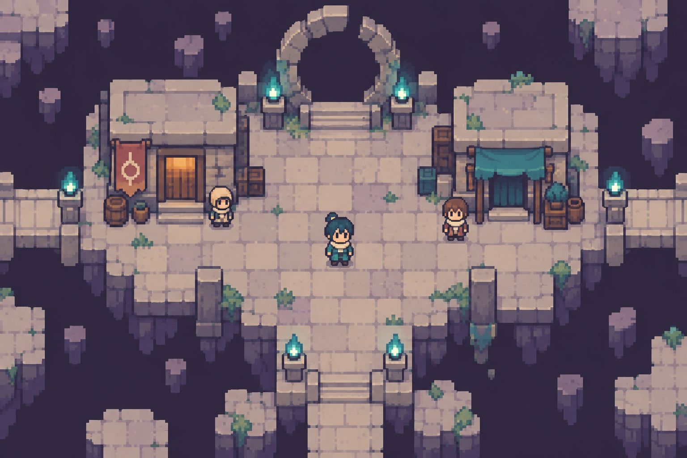

# U-009 深淵｜GBA 像素主視覺

[返回總覽](README.md) · [世界觀來源](SOURCES.md)

道主：亞茲；大道：空；法則：靈魂。名稱與對應沿用來源；以下場景造型為本次新增美術設計。

**虛無中仍有人為靈魂留下一盞燈。**

畫面位置：未命名裂隙聚落・守燈石台（視覺提案）。這是宇宙的代表街區視覺，非整顆星球鳥瞰，也不表示其他城市使用相同布局。

## 視覺語言

| 項目 | 規格 |
|---|---|
| 建築輪廓 | 缺角石台、斷拱、大片留白與孤立連橋 |
| 材質 | 失色石材、裂面黑曜石、舊繩、微亮魂晶 |
| 地貌 | 斷裂陸塊、安靜空隙、少量孤立庇護所 |
| 標誌地標 | 破裂圓拱與繫在路邊的魂燈 |
| 居民 | 有明亮領巾的旅者、兜帽守燈人 |
| 像素動態 | 魂燈慢速兩格、裂隙邊緣短暫像素缺角 |
| 避免 | 克蘇魯觸手堆、透視奇觀、漆黑地面吞掉人物 |

基礎色盤（順序為深色／主色／輔色／亮色或地表／點綴的設計組合，實際語義依材質分配）：`#272B41`、`#655B86`、`#9393A8`、`#CDBD91`、`#6DABAB`。這些是製作目標色，生成概念圖未做嚴格索引色驗證，不宣稱其像素完全符合色碼。

## 星球與城市延伸

### U-009-P1 未命名星球 A（提案）

地貌：斷裂陸塊。

| 地點代碼 | 類型與視覺規格 | 狀態 |
|---|---|---|
| U-009-P1-C1 | 守燈聚落：缺角石台、魂燈、破拱 | 美術模板；非正式地名 |
| U-009-P1-C2 | 繫橋聚落：繩橋、短石墩、繫魂柱 | 美術模板；非正式地名 |

同星球保留材質和地表規則；兩地用主要功能、屋頂外形及道路寬窄區分。

### U-009-P2 未命名星球 B（提案）

地貌：失色空寂荒原。

| 地點代碼 | 類型與視覺規格 | 狀態 |
|---|---|---|
| U-009-P2-C1 | 回聲城區：重複門框、少量殘牆 | 美術模板；非正式地名 |
| U-009-P2-C2 | 避難城區：保暖布棚、碎石庭院、單一暖燈 | 美術模板；非正式地名 |

同星球保留材質和地表規則；兩地用主要功能、屋頂外形及道路寬窄區分。

## 素材拆解與 Blender 製作

- 保留共同 16×16 地磚、16×24 地圖人物、四方向三格走路規格。大型建築以 16px 倍數分件；人物腳底定位保持一致。
- Blender 優先製作「破裂圓拱與繫在路邊的魂燈」及兩種基本屋型；同一相機、相同像素密度、固定光向。以材質和輪廓變體衍生城市，避免只替換 hue。
- 第一批：地表主磚 4 款、邊角／過渡磚 12 款、屋型 2 組、地標 1 組、道具 6 款、環境動畫 2 組。數量是製作預算，不是本次已交付素材。
- 神祕特效必須保留可走地面的明暗邊界；互動物除色彩外，再用形狀和描邊提示。
- 場景從探索地圖延伸到戰鬥背景時沿用同一屋頂／石材／地貌語言；卡牌玩法未定，不強制規劃卡牌 UI。

## 驗收與限制

目前交付為 AI 生成概念 PNG，已目視檢查主題、角色可讀性及整體風格。不是可直接切割的地磚圖集，不含動畫、碰撞或 .blend 場景。製作階段仍需統一像素格、限制色階、簡化紋理；檢查原尺寸、整數放大與不同顯示大小。概念圖中的字形般裝飾只作符號參考，正式文字由 Godot UI 繪製。
